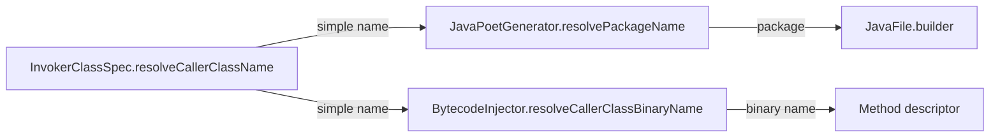

# Design Document: Generated Class Naming

## Overview

This feature changes the naming scheme for classes generated by the Rawit annotation processor and relocates them into a `.generated` subpackage. The current scheme produces collisions when multiple `@Constructor`-annotated classes exist in the same package (both generate a class named `Constructor`). The new scheme:

1. Prefixes generated class names with the enclosing class's simple name
2. Appends a suffix indicating the annotation type (`Invoker` or `Constructor`)
3. Places all generated classes in a `<pkg>.generated` subpackage

The change touches three components that must stay in sync: `InvokerClassSpec` (source class name), `JavaPoetGenerator` (target package), and `BytecodeInjector` (binary name for bridge method return types).

## Architecture

No architectural changes. The existing two-phase approach remains:

1. **Phase 1 — Source generation** (JavaPoet): `InvokerClassSpec` builds the `TypeSpec`, `JavaPoetGenerator` writes it to the filer with the resolved package name.
2. **Phase 2 — Bytecode injection** (ASM): `BytecodeInjector` injects parameterless bridge methods whose return type descriptor references the generated class by binary name.

The naming logic is localized to three methods across three files:



Both `resolveCallerClassName()` and `resolveCallerClassBinaryName()` must produce the same simple class name. Both `resolvePackageName()` and the package portion of `resolveCallerClassBinaryName()` must produce the same package (with `/` vs `.` separators).

## Components and Interfaces

### 1. `InvokerClassSpec.resolveCallerClassName()`

**Current behavior:**
- `@Constructor` → `"Constructor"`
- `@Invoker` on constructor (`<init>`) → `"<SimpleName>Invoker"` (e.g., `"FooInvoker"`)
- `@Invoker` on method → `PascalCase(methodName)` (e.g., `"Add"`)

**New behavior:**
- `@Constructor` → `"<EnclosingSimpleName>Constructor"` (e.g., `"PointConstructor"`)
- `@Invoker` on constructor (`<init>`) → `"<EnclosingSimpleName>Invoker"` (e.g., `"FooInvoker"`) — unchanged
- `@Invoker` on method → `"<EnclosingSimpleName><PascalCaseMethodName>Invoker"` (e.g., `"CalculatorAddInvoker"`)

**Implementation:** Extract the enclosing class simple name from `tree.group().enclosingClassName()` (binary name with `/` separators), then compose the new name based on annotation type and group name.

### 2. `JavaPoetGenerator.resolvePackageName()`

**Current behavior:** Extracts the package from the enclosing class binary name (everything before the last `.`).

**New behavior:** Appends `.generated` to the extracted package. If the enclosing class is in the default package, returns `"generated"`.

**Implementation:** One-line change — append `.generated` to the existing result, or return `"generated"` if the base package is empty.

### 3. `BytecodeInjector` — `resolveCallerClassBinaryName()` and `packagePrefix()`

**Current behavior:**
- `packagePrefix()` returns everything up to and including the last `/` in the enclosing class binary name.
- `resolveCallerClassBinaryName()` composes `packagePrefix + simpleName`.

**New behavior:**
- `packagePrefix()` inserts `generated/` after the existing package prefix. For default package, returns `"generated/"`.
- `resolveCallerClassBinaryName()` uses the same naming rules as `resolveCallerClassName()` for the simple name portion, composed with the updated package prefix.

**Implementation:** Modify `packagePrefix()` to append `generated/`. Update `resolveCallerClassBinaryName()` to use `<EnclosingSimpleName><PascalCaseMethodName>Invoker` for `@Invoker` on methods, `<EnclosingSimpleName>Constructor` for `@Constructor`, and `<EnclosingSimpleName>Invoker` for `@Invoker` on constructors.

### Naming Algorithm (Pseudocode)

```
function resolveCallerClassName(tree):
    enclosing = tree.group().enclosingClassName()
    simpleName = enclosing after last '/'
    groupName = tree.group().groupName()

    if isConstructorAnnotation:
        return simpleName + "Constructor"
    if groupName == "<init>":
        return simpleName + "Invoker"
    return simpleName + PascalCase(groupName) + "Invoker"
```

```
function resolvePackageName(binaryName):
    pkg = binaryName up to last '.'
    if pkg is empty:
        return "generated"
    return pkg + ".generated"
```

```
function resolveCallerClassBinaryName(tree):
    enclosing = tree.group().enclosingClassName()
    prefix = packagePrefix(enclosing)  // e.g., "com/example/model/generated/"
    simpleName = resolveCallerClassName(tree)  // same logic
    return prefix + simpleName
```

```
function packagePrefix(binaryClassName):
    lastSlash = binaryClassName.lastIndexOf('/')
    if lastSlash < 0:
        return "generated/"
    return binaryClassName[0..lastSlash] + "/generated/"
```

## Data Models

No changes to data models. The existing `OverloadGroup`, `AnnotatedMethod`, `MergeTree`, and `Parameter` records remain unchanged. The naming logic derives everything it needs from `OverloadGroup.enclosingClassName()`, `OverloadGroup.groupName()`, and `AnnotatedMethod.isConstructorAnnotation()`.


## Correctness Properties

*A property is a characteristic or behavior that should hold true across all valid executions of a system — essentially, a formal statement about what the system should do. Properties serve as the bridge between human-readable specifications and machine-verifiable correctness guarantees.*

### Property 1: InvokerClassSpec naming correctness

*For any* `OverloadGroup` with a valid `enclosingClassName` and `groupName`, `resolveCallerClassName()` shall produce:
- `<EnclosingSimpleName>Constructor` when all members have `isConstructorAnnotation=true`
- `<EnclosingSimpleName>Invoker` when `groupName` is `<init>` and members are `@Invoker`-annotated
- `<EnclosingSimpleName><PascalCaseGroupName>Invoker` when `groupName` is a regular method name

**Validates: Requirements 1.1, 2.1, 3.1**

### Property 2: BytecodeInjector binary name correctness

*For any* `MergeTree` with a valid `OverloadGroup`, `resolveCallerClassBinaryName()` shall produce a binary name of the form `<pkg>/generated/<SimpleClassName>` where `<SimpleClassName>` follows the same rules as Property 1, and the `generated/` segment is always present between the package prefix and the simple name.

**Validates: Requirements 1.2, 2.2, 3.2, 4.2, 5.3**

### Property 3: JavaPoetGenerator package correctness

*For any* enclosing class binary name, `resolvePackageName()` shall produce a package name equal to the enclosing class's package with `.generated` appended. When the enclosing class is in the default (empty) package, the result shall be `"generated"`.

**Validates: Requirements 4.1, 4.3**

### Property 4: Cross-component naming consistency

*For any* `OverloadGroup`, the simple class name produced by `InvokerClassSpec.resolveCallerClassName()` shall equal the simple name portion (after the last `/`) of the binary name produced by `BytecodeInjector.resolveCallerClassBinaryName()`, and the package produced by `JavaPoetGenerator.resolvePackageName()` shall equal the package portion of the binary name (with `/` replaced by `.`).

**Validates: Requirements 5.1, 5.2**

## Error Handling

No new error conditions are introduced. The existing error handling in all three components remains unchanged:

- **JavaPoetGenerator**: `FilerException` on duplicate writes is caught and logged as `NOTE` (idempotency guard). `IOException` on write failure is logged as `ERROR`.
- **BytecodeInjector**: `VerifyError` on invalid bytecode preserves the original `.class` file and emits `ERROR`. Missing `.class` files are silently skipped.
- **InvokerClassSpec**: No I/O; naming is a pure computation with no failure modes.

The `.generated` subpackage does not need to be pre-created — the `Filer` and file system handle directory creation automatically.

## Testing Strategy

### Property-Based Testing

Use **jqwik** (already in the project) for property-based tests. Each property test runs a minimum of 100 iterations.

**Property 1 & 2** — Test `resolveCallerClassName()` and `resolveCallerClassBinaryName()` by generating random `OverloadGroup` instances with varying:
- Enclosing class names (with/without packages, single/multi-segment packages)
- Group names (regular methods, `<init>`)
- Annotation types (`@Invoker` vs `@Constructor`)

Then assert the output matches the expected naming pattern.

**Property 3** — Test `resolvePackageName()` by generating random binary class names (including default package) and asserting the result ends with `.generated` (or equals `"generated"` for default package).

**Property 4** — Test cross-component consistency by generating random `MergeTree` instances and comparing the outputs of all three naming methods.

Tag format: `Feature: generated-class-naming, Property {N}: {title}`

### Unit Testing

Update existing unit tests to assert the new naming patterns:

- **InvokerClassSpecTest**: Update `callerClassNamedAfterMethodInPascalCase` → assert `"FooBarInvoker"` instead of `"Bar"`. Update `callerClassNamedConstructorForConstructorAnnotation` → assert `"FooConstructor"` instead of `"Constructor"`.
- **JavaPoetGeneratorTest**: Update assertions to expect the `.generated` package in written file keys.
- **BytecodeInjectorPropertyTest**: Update `property4` and `property7` to expect the `generated/` segment in return type descriptors.
- **Integration tests**: Update `RawitAnnotationProcessorIntegrationTest`, `RawitAnnotationProcessorPropertyTest`, and `RawitAnnotationProcessorConstructorPropertyTest` to load generated classes from the `generated` subpackage (e.g., `loader.loadClass("generated.PointConstructor")` instead of `loader.loadClass("Constructor")`).
- **Sample tests**: The call-site syntax (`Point.constructor().x(10).y(20).construct()`) does not change. Only explicit imports or class references to generated classes need updating.

### Test Configuration

- Property tests: minimum 100 iterations (jqwik `@Property(tries = 100)`)
- BytecodeInjector property tests: 5 iterations (compilation is expensive)
- Integration/end-to-end property tests: 5 iterations (compilation is expensive)
- Each property test tagged with: `Feature: generated-class-naming, Property {N}: {title}`
