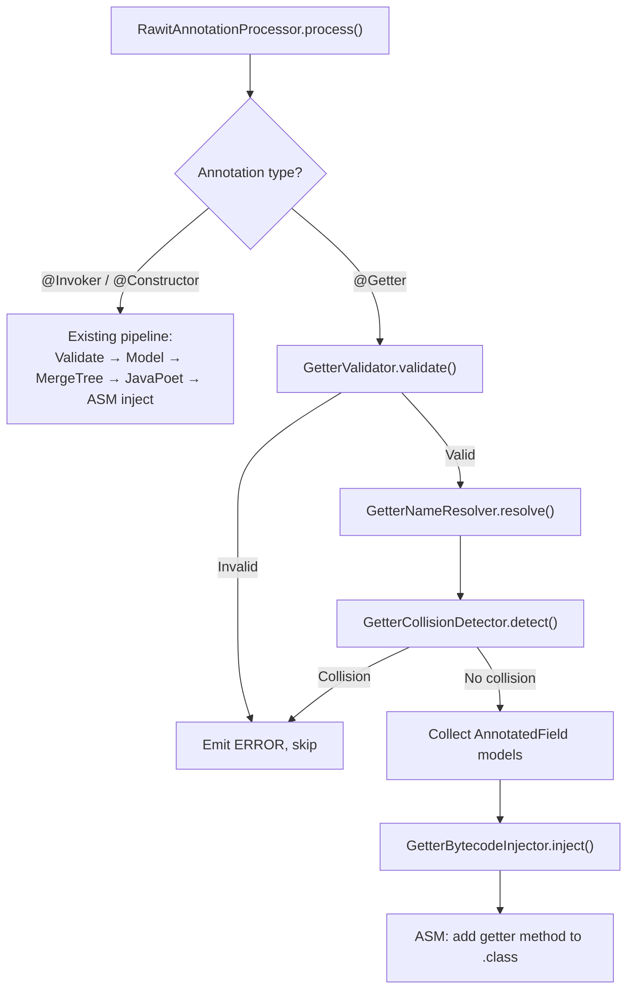

# Design Document: @Getter Annotation

## Overview

This design adds a `@Getter` annotation to the rawit annotation processor. When applied to a field, the processor generates a public getter method on the enclosing class via ASM bytecode injection, following the same injection pattern used by `@Invoker` and `@Constructor`.

The getter naming follows legacy Lombok conventions: primitive `boolean` fields use the `is` prefix (with three edge cases), while boxed `Boolean` and all other types use the standard `get` prefix. The processor validates fields for disallowed modifiers (volatile, transient), anonymous class enclosure, and getter name collisions (same-class methods, inter-getter conflicts, inherited methods, and covariant return type compatibility in field-hiding scenarios).

Unlike `@Invoker`/`@Constructor` which generate separate source files via JavaPoet, `@Getter` injects methods directly into the enclosing class's bytecode via ASM — no intermediate source files or staged APIs are needed.

## Architecture

The `@Getter` processing pipeline integrates into the existing `RawitAnnotationProcessor` as a parallel processing path alongside `@Invoker`/`@Constructor`:



The key architectural decision is that `@Getter` does NOT use JavaPoet or the MergeTree pipeline. Getter methods are simple field accessors with no staged API, so they are injected directly as bytecode into the enclosing class's `.class` file using ASM. This follows the same `BytecodeInjector` pattern (read `.class` → ClassVisitor → write `.class`) but with a dedicated `GetterBytecodeInjector` that adds getter methods instead of parameterless overloads.

### Processing Phases

1. **Discovery**: `RawitAnnotationProcessor` collects `@Getter`-annotated field elements from the round environment.
2. **Validation**: `GetterValidator` checks each field for disallowed modifiers (volatile/transient), anonymous class enclosure, and builds an `AnnotatedField` model.
3. **Name Resolution**: `GetterNameResolver` computes the getter method name based on field type and name (handling primitive boolean `is`-prefix logic).
4. **Collision Detection**: `GetterCollisionDetector` checks for name collisions against existing methods in the same class, other `@Getter` fields in the same class, inherited methods from superclasses, and covariant return type compatibility in field-hiding scenarios.
5. **Bytecode Injection**: `GetterBytecodeInjector` injects the getter methods into the `.class` file via ASM.

## Components and Interfaces

### 1. `rawit.Getter` — Annotation Definition

```java
@Target(ElementType.FIELD)
@Retention(RetentionPolicy.SOURCE)
public @interface Getter {}
```

Targets fields only. `SOURCE` retention means it's discarded after annotation processing (same as `@Invoker` and `@Constructor`).

### 2. `rawit.processors.model.AnnotatedField` — Field Model

```java
public record AnnotatedField(
    String enclosingClassName,    // binary name, e.g. "com/example/Foo"
    String fieldName,             // e.g. "firstName"
    String fieldTypeDescriptor,   // JVM descriptor, e.g. "Ljava/lang/String;"
    String fieldTypeSignature,    // generic signature (nullable), e.g. "Ljava/util/List<Ljava/lang/String;>;"
    boolean isStatic,             // whether the field is static
    String getterName             // computed getter name, e.g. "getFirstName"
) {}
```

This is the `@Getter` equivalent of `AnnotatedMethod`. It captures everything needed for bytecode injection with no dependency on `javax.lang.model` types after construction.

### 3. `rawit.processors.validation.GetterValidator` — Validation

Validates `@Getter`-annotated field elements. Checks:
- Field is not `volatile` or `transient`
- Enclosing class is not anonymous
- Returns `ValidationResult.valid()` or `ValidationResult.invalid()` (reuses existing sealed interface)

```java
public class GetterValidator {
    public ValidationResult validate(Element element, Messager messager) { ... }
}
```

### 4. `rawit.processors.getter.GetterNameResolver` — Name Computation

Pure function that computes the getter method name from a field name and type descriptor.

```java
public class GetterNameResolver {
    /**
     * @param fieldName          the field name, e.g. "active", "isActive", "isinTimezone"
     * @param fieldTypeDescriptor JVM type descriptor, e.g. "Z" for primitive boolean
     * @return the getter method name, e.g. "isActive", "isActive", "isIsinTimezone"
     */
    public String resolve(String fieldName, String fieldTypeDescriptor) { ... }
}
```

Rules:
1. If `fieldTypeDescriptor` is `"Z"` (primitive boolean):
   - If `fieldName` starts with `is` followed by an uppercase letter → return `fieldName` as-is
   - If `fieldName` starts with `is` followed by a non-uppercase letter → return `"is"` + capitalize(`fieldName`)
   - Otherwise → return `"is"` + capitalize(`fieldName`)
2. For all other types (including boxed `Boolean` = `"Ljava/lang/Boolean;"`):
   - Return `"get"` + capitalize(`fieldName`)

### 5. `rawit.processors.getter.GetterCollisionDetector` — Collision Detection

Detects getter name collisions across four dimensions:

```java
public class GetterCollisionDetector {
    /**
     * @param fields   all @Getter-annotated fields in the same enclosing class
     * @param element  the TypeElement of the enclosing class
     * @param messager for emitting errors
     * @return list of AnnotatedField models that passed collision checks
     */
    public List<AnnotatedField> detect(
        List<AnnotatedField> fields,
        TypeElement enclosingClass,
        Messager messager,
        Types typeUtils
    ) { ... }
}
```

Collision checks:
1. **Same-class method collision**: A zero-parameter method with the same name already exists in the enclosing class (not generated by `@Getter`).
2. **Inter-getter collision**: Two or more `@Getter` fields in the same class produce the same getter name.
3. **Inherited method collision**: A zero-parameter method with the same name is inherited from a superclass (and was not generated by the `@Getter` processor).
4. **Covariant return type validation**: When a derived class hides a base class field and both are `@Getter`-annotated, the derived field type must be a subtype of the base field type. If not, emit an error.

### 6. `rawit.processors.inject.GetterBytecodeInjector` — Bytecode Injection

Injects getter methods into the `.class` file using ASM. Follows the same pattern as `BytecodeInjector`:

```java
public class GetterBytecodeInjector {
    public void inject(Path classFilePath, List<AnnotatedField> fields, ProcessingEnvironment env) { ... }
}
```

For each `AnnotatedField`, the injector:
1. Checks idempotency — if a method with the getter name and `()` descriptor already exists, skip.
2. Adds the getter method via `ClassWriter.visitMethod`:
   - Access: `ACC_PUBLIC` (+ `ACC_STATIC` if the field is static)
   - Name: the computed getter name
   - Descriptor: `()` + field type descriptor
   - Signature: `()` + field type signature (for generic type preservation)
   - Body: `GETFIELD`/`GETSTATIC` + appropriate return instruction
3. Verifies and writes the modified bytecode back.

### 7. Integration into `RawitAnnotationProcessor`

The processor's `process()` method gains a new branch for `@Getter`:

```java
// After existing @Invoker/@Constructor processing:
// --- @Getter processing ---
for (Element element : roundEnv.getElementsAnnotatedWith(getterAnnotation)) {
    ValidationResult result = getterValidator.validate(element, messager);
    if (result instanceof ValidationResult.Invalid) continue;
    AnnotatedField field = buildAnnotatedField((VariableElement) element);
    // group by enclosing class...
}
// collision detection per class...
// bytecode injection per class...
```

## Data Models

### AnnotatedField Record

```java
public record AnnotatedField(
    String enclosingClassName,     // "com/example/Foo"
    String fieldName,              // "firstName"
    String fieldTypeDescriptor,    // "Ljava/lang/String;"
    String fieldTypeSignature,     // "Ljava/util/List<Ljava/lang/String;>;" or null
    boolean isStatic,              // true for static fields
    String getterName              // "getFirstName" (pre-computed)
) {}
```

### Getter Name Resolution Decision Table

| Field Type | Field Name Pattern | Getter Name | Example |
|---|---|---|---|
| `boolean` (primitive) | No `is` prefix | `is` + capitalize(name) | `active` → `isActive()` |
| `boolean` (primitive) | `is` + uppercase | field name as-is | `isActive` → `isActive()` |
| `boolean` (primitive) | `is` + non-uppercase | `is` + capitalize(name) | `isinTimezone` → `isIsinTimezone()` |
| `Boolean` (boxed) | any | `get` + capitalize(name) | `active` → `getActive()` |
| All other types | any | `get` + capitalize(name) | `firstName` → `getFirstName()` |

### ASM Bytecode Generation

For an instance field `private String firstName`:
```
public String getFirstName() {
    // ACC_PUBLIC
    // Descriptor: ()Ljava/lang/String;
    ALOAD 0          // load 'this'
    GETFIELD com/example/Foo.firstName : Ljava/lang/String;
    ARETURN
}
```

For a static field `private static int count`:
```
public static int getCount() {
    // ACC_PUBLIC | ACC_STATIC
    // Descriptor: ()I
    GETSTATIC com/example/Foo.count : I
    IRETURN
}
```

Return instruction selection by type descriptor:
| Descriptor | Return Opcode |
|---|---|
| `Z`, `B`, `C`, `S`, `I` | `IRETURN` |
| `J` | `LRETURN` |
| `F` | `FRETURN` |
| `D` | `DRETURN` |
| `L...;`, `[...` | `ARETURN` |


## Correctness Properties

*A property is a characteristic or behavior that should hold true across all valid executions of a system — essentially, a formal statement about what the system should do. Properties serve as the bridge between human-readable specifications and machine-verifiable correctness guarantees.*

### Property 1: Getter name computation follows naming conventions

*For any* field name and field type descriptor, the computed getter name must satisfy:
- If the type is primitive boolean (`Z`) and the name does not start with `is` followed by an uppercase letter, the getter name is `"is"` + capitalize(fieldName).
- If the type is primitive boolean (`Z`) and the name starts with `is` followed by an uppercase letter, the getter name equals the field name.
- If the type is not primitive boolean (including boxed `Boolean`), the getter name is `"get"` + capitalize(fieldName).

**Validates: Requirements 2.2, 4.1, 4.2, 4.3, 5.1**

### Property 2: Static/instance modifier matching

*For any* annotated field, the generated getter method is static if and only if the field is static.

**Validates: Requirements 3.1, 3.2**

### Property 3: Return type matches field type including generics

*For any* annotated field with a type descriptor and optional generic signature, the generated getter method's return type descriptor equals the field's type descriptor, and the getter's generic signature (if present) equals `()` + the field's generic type signature.

**Validates: Requirements 2.3, 9.1, 9.2**

### Property 4: Generated getter is always public

*For any* annotated field regardless of the field's own access modifier (private, protected, public, or package-private), the generated getter method has `ACC_PUBLIC` access.

**Validates: Requirements 2.5, 7.1**

### Property 5: Volatile and transient fields are rejected

*For any* field annotated with `@Getter` that has the `volatile` or `transient` modifier, the validator must return `Invalid`.

**Validates: Requirements 10.1, 10.2**

### Property 6: Anonymous class fields are rejected, all other class kinds accepted

*For any* field annotated with `@Getter`, validation rejects the field if and only if the enclosing class is anonymous. Fields in enums, named inner classes, static inner classes, local classes, and top-level classes are accepted.

**Validates: Requirements 11.1, 11.2, 11.3, 11.4, 11.5**

### Property 7: Same-class method collision detection

*For any* class containing a zero-parameter method with name N and a `@Getter`-annotated field whose computed getter name is also N, the collision detector must report an error for that field.

**Validates: Requirements 6.1**

### Property 8: Inter-getter collision detection

*For any* class containing two or more `@Getter`-annotated fields whose computed getter names are identical, the collision detector must report an error for the conflicting fields.

**Validates: Requirements 6.2**

### Property 9: Inherited method collision detection

*For any* class that inherits a zero-parameter method with name N from a superclass (where that method was not generated by the `@Getter` processor), and contains a `@Getter`-annotated field whose computed getter name is also N, the collision detector must report an error.

**Validates: Requirements 12.1**

### Property 10: Covariant return type validation in field hiding

*For any* field-hiding scenario where both the base class field and derived class field are annotated with `@Getter`, the processor allows the override if and only if the derived field's type is a subtype of (or equal to) the base field's type. When the types are incompatible, the processor must emit an error.

**Validates: Requirements 8.6, 8.7**

## Error Handling

### Compile-Time Errors

All errors are emitted via `Messager.printMessage(Diagnostic.Kind.ERROR, ...)` with the annotated element as the source location, following the existing pattern in `ElementValidator`.

| Condition | Error Message |
|---|---|
| Volatile field | `@Getter is not supported on volatile fields` |
| Transient field | `@Getter is not supported on transient fields` |
| Anonymous class | `@Getter is not supported inside anonymous classes` |
| Same-class collision | `getter '{name}()' conflicts with existing method in {class}` |
| Inter-getter collision | `getter '{name}()' conflicts with another @Getter field in {class}` |
| Inherited method collision | `getter '{name}()' conflicts with inherited method from {superclass}` |
| Incompatible covariant return | `getter '{name}()' in {derived} cannot override getter in {base}: incompatible return types {derivedType} and {baseType}` |

### Bytecode Injection Errors

Following the existing `BytecodeInjector` pattern:
- `IOException` reading/writing `.class` file → `ERROR` diagnostic, original file preserved
- ASM `CheckClassAdapter` verification failure → `ERROR` diagnostic, original file preserved
- `.class` file not found → silently skip (same as existing behavior for single-pass compiles)

### Idempotency

If a getter method with the computed name and `()` descriptor already exists in the `.class` file, the injection is skipped silently (same idempotency guard as `BytecodeInjector`).

## Testing Strategy

### Property-Based Testing

The project uses **jqwik** (already in `pom.xml`) for property-based testing. Each correctness property maps to a single `@Property` test method with a minimum of 100 tries.

Each property test must be tagged with a comment:
```java
// Feature: getter-annotation, Property N: <property text>
```

Key property tests:

1. **GetterNameResolverPropertyTest** — Tests Property 1 (name computation). Generates random field names and type descriptors, verifies naming rules. Covers the three primitive boolean edge cases as generator-driven edge cases.

2. **GetterBytecodeInjectorPropertyTest** — Tests Properties 2, 3, 4 (static matching, return type, public access). Generates random `AnnotatedField` instances, injects into a synthetic `.class` file, reads back via ASM, and verifies the injected method's access flags, descriptor, and signature.

3. **GetterValidatorPropertyTest** — Tests Properties 5, 6 (volatile/transient rejection, anonymous class rejection). Generates random field elements with various modifier combinations and enclosing class kinds.

4. **GetterCollisionDetectorPropertyTest** — Tests Properties 7, 8, 9 (collision detection). Generates random class structures with existing methods, multiple `@Getter` fields, and inherited methods.

5. **GetterCovariantReturnPropertyTest** — Tests Property 10 (covariant return type validation). Generates random type hierarchies and field-hiding scenarios.

### Unit Testing

Unit tests complement property tests for specific examples and edge cases:

- **GetterNameResolverTest** — Specific examples: `active` → `isActive`, `isActive` → `isActive`, `isinTimezone` → `isIsinTimezone`, `Boolean active` → `getActive`, `String name` → `getName`.
- **GetterValidatorTest** — Specific examples: volatile field rejected, transient field rejected, anonymous class rejected, enum field accepted.
- **GetterCollisionDetectorTest** — Specific examples: existing `getName()` method + `@Getter String name` → error, two fields both producing `getName` → error.
- **GetterBytecodeInjectorTest** — Integration: inject a getter into a real `.class` file, load the class, invoke the getter via reflection, verify the returned value.
- **RawitAnnotationProcessorGetterIntegrationTest** — End-to-end: compile a test source file with `@Getter` fields, verify the generated getters are callable.
