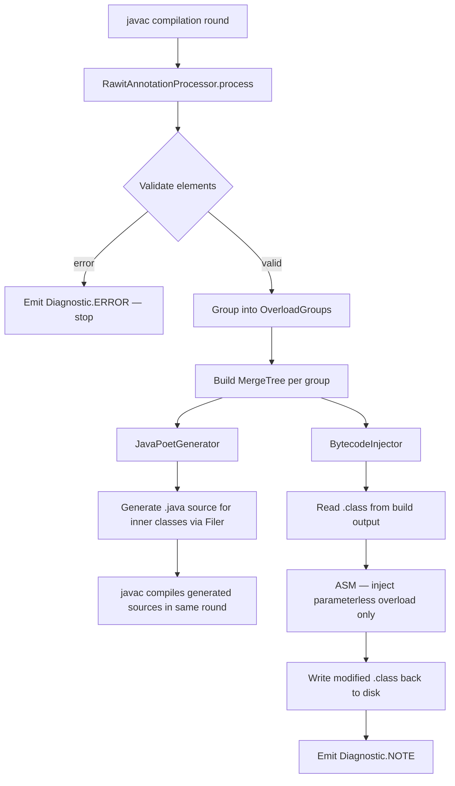

# Design Document — Project Rawit Curry

## Overview

Project Rawit is a Java 21 annotation processor library that transforms annotated methods and
constructors into staged, fluent call chains at compile time. It operates like Lombok: rather than
generating a separate companion class, it injects new members directly into the original class's
`.class` file in the build output directory.

Two annotations are provided:

- `@Invoker` — placed on a method or constructor. Injects a parameterless overload and a staged
  invocation call chain into the original class. The chain ends with `.invoke()`.
- `@Constructor` — placed on a constructor. Injects a `public static constructor()` entry point
  and a staged construction chain. The chain ends with `.construct()`.

### Motivating Example

```java
// Source
class Foo {
    @Invoker
    public int add(int x, int y) { return x + y; }
}

// After processing — usage
int result = new Foo().add().x(3).y(4).invoke(); // == 7
```

```java
// Source
class Point {
    @Constructor
    public Point(int x, int y) { ... }
}

// After processing — usage
Point p = Point.constructor().x(1).y(2).construct();
```

---

## Architecture

### High-Level Pipeline



The processor runs inside `javac`. It uses JavaPoet to generate `.java` source files for all
generated types (Caller_Class, Stage_Interfaces, InvokeStageInvoker, ConstructStageInvoker), which
are written via the `Filer` API and compiled by `javac` in the same round. The only bytecode
manipulation performed by ASM is injecting the parameterless overload method into the *original*
`.class` file — since the original source cannot be modified, this narrow injection still requires
ASM.

### Key Design Decisions

1. **JavaPoet for generated types** — JavaPoet produces readable, maintainable Java source for all
   generated inner classes and interfaces (Caller_Class, Stage_Interfaces, InvokeStageInvoker,
   ConstructStageInvoker). The `Filer` API writes these `.java` files to the build output, and
   `javac` compiles them in the same round. This matches standard annotation-processor practice and
   makes the generated code inspectable.
2. **ASM for parameterless overload injection only** — The original source file cannot be modified,
   so injecting the parameterless overload (e.g. `bar()`, `constructor()`) into the original
   `.class` file still requires bytecode manipulation. ASM is used for this narrow task because it
   gives precise control over the constant pool and method descriptors.
3. **Bytecode manipulation over source generation for the original class** — Injecting into the
   original class avoids the need for users to reference a separate generated class. This matches
   the Lombok model.
4. **Single-pass injection** — The parameterless overload for a given class is injected in one ASM
   pass to avoid multiple read/write cycles.
5. **Idempotency guard for generated sources** — The `Filer` API throws `FilerException` if a
   source file already exists. The processor catches this and logs it as `NOTE`, preventing
   duplicate generation on incremental builds. For the ASM-injected overload, the injector checks
   for the presence of the `@Generated` marker before writing.

### Module Breakdown

```
rawit/
  Invoker.java                      — @Invoker annotation
  Constructor.java                  — @Constructor annotation (to be created)
  processors/
    RawitAnnotationProcessor.java   — AbstractProcessor entry point (handles both annotations)
    validation/
      ElementValidator.java         — Validates @Invoker and @Constructor usage rules
    model/
      AnnotatedMethod.java          — Immutable model of a validated annotated element
      OverloadGroup.java            — A named group of AnnotatedMethods sharing a name
      MergeTree.java                — The merged stage tree for an OverloadGroup
      MergeNode.java                — A single node in the MergeTree (shared or branching)
    merge/
      MergeTreeBuilder.java         — Builds a MergeTree from an OverloadGroup
    codegen/
      JavaPoetGenerator.java        — Orchestrates JavaPoet source generation for all groups
      InvokerClassSpec.java         — Builds TypeSpec for the Caller_Class using JavaPoet
      StageInterfaceSpec.java       — Builds TypeSpec for each Stage_Interface using JavaPoet
      TerminalInterfaceSpec.java    — Builds TypeSpec for InvokeStageInvoker / ConstructStageInvoker
    inject/
      BytecodeInjector.java         — ASM injection of the parameterless overload ONLY
      OverloadResolver.java         — Resolves the .class file path from the build output dir
```

---

## Components and Interfaces

### RawitAnnotationProcessor

Entry point. Extends `AbstractProcessor`. Handles both `@Invoker` and `@Constructor`.

```java
@SupportedOptions({"invoker.debug"})
public class RawitAnnotationProcessor extends AbstractProcessor {
    boolean process(Set<? extends TypeElement> annotations, RoundEnvironment roundEnv);
}
```

Responsibilities:
- Delegates validation to `ElementValidator`.
- Groups valid elements into `OverloadGroup` instances per enclosing class + method name.
- Calls `MergeTreeBuilder` to produce a `MergeTree` per group.
- Calls `JavaPoetGenerator` to write generated source files via the `Filer` API.
- Calls `BytecodeInjector` once per enclosing class to inject the parameterless overload.
- Emits `NOTE` / `ERROR` diagnostics via `Messager`.
- Returns `false` from `process()` so other processors can observe the annotations.

### ElementValidator

```java
public class ElementValidator {
    ValidationResult validate(Element element, Messager messager);
}
```

Checks:
- Element kind is `METHOD` or `CONSTRUCTOR` (for `@Invoker`); `CONSTRUCTOR` only (for `@Constructor`).
- Parameter count ≥ 1.
- Visibility is not `private`.
- No existing zero-parameter overload with the same name (checked against the enclosing type's
  members via `Elements` utility).

### AnnotatedMethod (model)

Immutable value object capturing everything needed for code generation:

```java
public record AnnotatedMethod(
    String enclosingClassName,   // binary name, e.g. "com/example/Foo"
    String methodName,           // "bar" or "<init>"
    boolean isStatic,
    boolean isConstructor,
    List<Parameter> parameters,  // ordered list
    String returnTypeDescriptor, // JVM descriptor, e.g. "I" or "V"
    List<String> checkedExceptions
) {}

public record Parameter(String name, String typeDescriptor) {}
```

### OverloadGroup (model)

```java
public record OverloadGroup(
    String enclosingClassName,
    String groupName,            // method name, or "<init>" for constructors
    List<AnnotatedMethod> members
) {}
```

### MergeTree / MergeNode (model)

The merge tree represents the unified stage graph for an overload group.

```java
public sealed interface MergeNode permits SharedNode, BranchingNode, TerminalNode {}

// A position where all overloads agree on name+type
public record SharedNode(
    String paramName,
    String typeDescriptor,
    MergeNode next              // next node in the chain
) implements MergeNode {}

// A position where overloads diverge
public record BranchingNode(
    List<Branch> branches       // one per distinct (name, type) variant
) implements MergeNode {}

public record Branch(
    String paramName,
    String typeDescriptor,
    MergeNode next
) {}

// Terminal: one or more overloads end here
public record TerminalNode(
    List<AnnotatedMethod> overloads,  // the overload(s) that terminate at this node
    MergeNode continuation            // non-null if longer overloads continue past here
) implements MergeNode {}
```

### MergeTreeBuilder

Builds a `MergeTree` from an `OverloadGroup` using the algorithm described in the Algorithms
section below.

```java
public class MergeTreeBuilder {
    public MergeTree build(OverloadGroup group);
}
```

### JavaPoetGenerator

Generates `.java` source files for all produced types (Caller_Class, Stage_Interfaces,
InvokeStageInvoker, ConstructStageInvoker) and writes them via the `Filer` API.

```java
public class JavaPoetGenerator {
    public void generate(List<MergeTree> trees, ProcessingEnvironment env);
}
```

For each `MergeTree`, it delegates to `CallerClassSpec`, `StageInterfaceSpec`, and
`TerminalInterfaceSpec` to build the `TypeSpec` objects, then writes them using:

```java
JavaFile.builder(packageName, typeSpec).build().writeTo(env.getFiler());
```

The generated `TypeSpec` for the Caller_Class is a `public static` class containing nested
interface `TypeSpec`s for each stage. If the `Filer` throws `FilerException` (file already
exists), the exception is caught and logged as `NOTE` — this is the idempotency guard for
generated sources.

### BytecodeInjector

Reads the `.class` file for the enclosing class, injects only the parameterless overload method,
and writes the result back.

```java
public class BytecodeInjector {
    public void inject(String classFilePath, List<MergeTree> trees, ProcessingEnvironment env);
}
```

The injector's sole responsibility is adding the zero-argument entry-point method (e.g. `bar()`,
`constructor()`) to the original `.class` file. All inner class and interface generation is
handled by `JavaPoetGenerator`. Uses ASM's `ClassReader` + `ClassWriter` with `COMPUTE_FRAMES` to
avoid manual stack-frame calculation.

---

## Data Models

### Parameter Representation

Parameters are stored as `(name, JVM type descriptor)` pairs. Primitive types use their JVM
one-character descriptors (`I`, `J`, `F`, `D`, `Z`, `B`, `C`, `S`). Object types use
`L<binary-name>;` form. Arrays use `[` prefix. This avoids any dependency on `javax.lang.model`
types at bytecode-injection time (the model is built during annotation processing and passed to
the injector).

### Stage Interface Naming

| Context | Convention | Example |
|---|---|---|
| `@Invoker` stage | `<PascalParam>StageInvoker` | `XStageInvoker` |
| `@Invoker` terminal | `InvokeStageInvoker` | `InvokeStageInvoker` |
| `@Constructor` stage | `<PascalParam>StageConstructor` | `IdStageConstructor` |
| `@Constructor` terminal | `ConstructStageInvoker` | `ConstructStageInvoker` |
| Branching stage (first param diverges) | `<PascalMethod>StageInvoker` | `BarStageInvoker` |

### Caller Class Naming

| Context | Inner class name |
|---|---|
| `@Invoker` on method `bar` | `Bar` (PascalCase of method name) |
| `@Constructor` | `Constructor` (literal) |

### Generated Member Inventory

For a `@Invoker` on `Foo.bar(int x, int y)`:

| Member | Kind | Location |
|---|---|---|
| `bar()` | instance method | `Foo` |
| `Bar` | `public static` inner class | `Foo` |
| `XStageInvoker` | interface | `Foo$Bar` |
| `YStageInvoker` | interface | `Foo$Bar` |
| `InvokeStageInvoker` | interface | `Foo$Bar` |

For a `@Constructor` on `Foo(int id, String name)`:

| Member | Kind | Location |
|---|---|---|
| `constructor()` | `public static` method | `Foo` |
| `Constructor` | `public static` inner class | `Foo` |
| `IdStageConstructor` | interface | `Foo$Constructor` |
| `NameStageConstructor` | interface | `Foo$Constructor` |
| `ConstructStageInvoker` | interface | `Foo$Constructor` |

### Immutability Invariant

Every field in a Caller_Class or Constructor_Caller_Class is `private final`. Each stage
transition creates a new instance of the Caller_Class, passing all previously accumulated
arguments plus the new one to the constructor. No field is ever mutated after construction.

The following shows the JavaPoet-generated `.java` source for `Foo.Bar` with params `(int x, int y)`:

```java
// Generated source — Foo.java (inner class written by JavaPoetGenerator via Filer)
public static final class Bar implements XStageInvoker {
    private final Foo __instance;

    private Bar(Foo instance) {
        this.__instance = instance;
    }

    @Override
    public YStageInvoker x(int x) {
        return new Bar$WithX(__instance, x);
    }

    @FunctionalInterface
    public interface XStageInvoker {
        YStageInvoker x(int x);
    }

    @FunctionalInterface
    public interface YStageInvoker {
        InvokeStageInvoker y(int y);
    }

    @FunctionalInterface
    public interface InvokeStageInvoker {
        int invoke();
    }

    private static final class Bar$WithX implements YStageInvoker {
        private final Foo __instance;
        private final int x;

        private Bar$WithX(Foo instance, int x) {
            this.__instance = instance;
            this.x = x;
        }

        @Override
        public InvokeStageInvoker y(int y) {
            return new Bar$WithXY(__instance, x, y);
        }
    }

    private static final class Bar$WithXY implements InvokeStageInvoker {
        private final Foo __instance;
        private final int x;
        private final int y;

        private Bar$WithXY(Foo instance, int x, int y) {
            this.__instance = instance;
            this.x = x;
            this.y = y;
        }

        @Override
        public int invoke() {
            return __instance.bar(x, y);
        }
    }
}
```

Alternatively (and more efficiently), a single flat Caller_Class holds all fields with a
per-stage constructor that only sets the fields accumulated so far. The JavaPoet generator may
use this flat approach to minimise the number of generated inner classes.

---

## Algorithms

### Algorithm 1: Overload Merge Tree Construction

Given an `OverloadGroup` with members `[m1, m2, ..., mk]`, each with a parameter list
`[(n1,t1), (n2,t2), ...]`:

```
function buildNode(overloads, position):
    if overloads is empty:
        return null

    // Partition: overloads that end at this position vs those that continue
    terminals = [o for o in overloads if len(o.params) == position]
    continuations = [o for o in overloads if len(o.params) > position]

    // Build the continuation sub-tree
    continuationNode = buildContinuation(continuations, position)

    if terminals is non-empty:
        return TerminalNode(terminals, continuationNode)
    else:
        return continuationNode

function buildContinuation(overloads, position):
    if overloads is empty:
        return null

    // Group by (name, type) at this position
    groups = groupBy(overloads, key = lambda o: (o.params[position].name, o.params[position].type))

    if len(groups) == 1:
        // All agree — shared node
        (name, type) = groups.keys()[0]
        next = buildNode(groups[(name,type)], position + 1)
        return SharedNode(name, type, next)
    else:
        // Check for same-name-different-type conflict (error condition)
        nameGroups = groupBy(overloads, key = lambda o: o.params[position].name)
        for name, members in nameGroups:
            types = distinct(o.params[position].type for o in members)
            if len(types) > 1:
                EMIT ERROR: conflicting types for parameter name
                return null

        // Divergence — branching node
        branches = []
        for (name, type), members in groups:
            next = buildNode(members, position + 1)
            branches.append(Branch(name, type, next))
        return BranchingNode(branches)
```

**Complexity**: O(k × p) where k = number of overloads, p = max parameter count.

### Algorithm 2: Stage Interface Name Resolution

```
function stageInterfaceName(node, methodName, isInvoker):
    suffix = "StageInvoker" if isInvoker else "StageConstructor"
    match node:
        SharedNode(paramName, ...) -> PascalCase(paramName) + suffix
        BranchingNode at position 0 -> PascalCase(methodName) + suffix
        BranchingNode at position n -> PascalCase(prevParamName) + suffix
        TerminalNode with continuation -> same as continuation's interface + "WithInvoke"
```

For a `TerminalNode` that also has a continuation (prefix overload case), the generated interface
exposes both `invoke()` / `construct()` and the next-parameter method(s). This is achieved by
having the Caller_Class implement both the terminal interface and the next stage interface at that
node.

### Algorithm 3: Bytecode Injection Strategy (Parameterless Overload Only)

The injector performs a single ASM pass per enclosing class to inject only the parameterless
overload method. All inner class and interface generation is handled by `JavaPoetGenerator`.

1. **Read** — `ClassReader.accept(visitor, 0)` to parse the existing `.class`.
2. **Detect idempotency** — If the class already contains a method with the overload name and zero
   parameters (e.g. `bar()` or `constructor()`), skip injection for that group.
3. **Inject parameterless overload** — Add a new method via `ClassWriter.visitMethod`. For
   instance methods, the method body loads `this` and calls `new Bar(this)`, returning it cast to
   the first stage interface. For static methods, it calls `new Bar()`. For constructors
   (`@Constructor`), it calls `new Constructor()`.
4. **Write** — `ClassWriter.toByteArray()` → overwrite the original `.class` file.

Note: `NestHost`/`NestMembers` attributes and `InnerClasses` attributes for the generated types
are handled automatically by `javac` when it compiles the JavaPoet-generated source files.

#### ASM Visitor Chain

```
ClassReader
  └─> ClassWriter (COMPUTE_FRAMES | COMPUTE_MAXS)
        └─> InjectionClassVisitor
              ├─> existing methods/fields pass-through
              └─> visitEnd() → injectParameterlessOverload()
```

---

## Error Handling

| Condition | Diagnostic | Code generation |
|---|---|---|
| `@Invoker` on zero-param method/constructor | `ERROR` | Skipped |
| `@Invoker` on private method/constructor | `ERROR` | Skipped |
| `@Constructor` on non-constructor element | `ERROR` | Skipped |
| `@Constructor` on zero-param constructor | `ERROR` | Skipped |
| `@Constructor` on private constructor | `ERROR` | Skipped |
| Parameterless overload name conflict | `ERROR` | Skipped for entire group |
| `constructor()` method already exists | `ERROR` | Skipped for entire group |
| Same param name, different types in overload group | `ERROR` | Skipped for entire group |
| Duplicate identical overloads (same name + params) | `ERROR` | Skipped for conflicting elements |
| `.class` file not found in build output | `ERROR` | Skipped |
| ASM `VerifyError` during injection | `ERROR` | Skipped, original `.class` preserved |

All errors reference the offending `Element` so IDEs can highlight the annotation site.

The processor always returns `false` from `process()` to remain non-exclusive.

---

## Testing Strategy

### Dual Testing Approach

Both unit tests and property-based tests are required. They are complementary:
- Unit tests verify specific examples, integration points, and error conditions.
- Property-based tests verify universal properties across many generated inputs.

### Property-Based Testing Library

Use **jqwik** (Java property-based testing library, compatible with JUnit 5) for all property
tests. Each property test runs a minimum of **100 iterations**.

Each property test is tagged with a comment in the format:
`// Feature: project-rawit-curry, Property N: <property text>`

### Unit Test Coverage

- `ElementValidator` — one test per validation rule (zero params, private, wrong element kind).
- `MergeTreeBuilder` — shared prefix, branching, prefix overload, conflict detection.
- `JavaPoetGenerator`, `InvokerClassSpec`, `StageInterfaceSpec`, `TerminalInterfaceSpec` — assert
  on generated source strings using `JavaFile.toString()` / `TypeSpec.toString()` (see Generated
  Source Assertions below).
- `BytecodeInjector` — load the modified `.class` via a `URLClassLoader` and reflectively verify
  the injected parameterless overload is present and returns the correct type.
- End-to-end compilation tests using `javax.tools.JavaCompiler` to compile annotated source and
  verify the resulting bytecode loads and behaves correctly.

### Property Test Coverage

Each correctness property defined in the next section maps to exactly one property-based test.

### Integration Test Strategy

Use `javax.tools.JavaCompiler` in tests to compile small annotated Java source strings, then load
the resulting `.class` files with a `URLClassLoader` and use reflection to:
1. Invoke the parameterless overload.
2. Chain through all stage methods.
3. Call `.invoke()` / `.construct()`.
4. Assert the result equals direct invocation.

This validates the full pipeline end-to-end without requiring a separate Maven build.

### Generated Source Assertions

Unit tests for `JavaPoetGenerator`, `InvokerClassSpec`, `StageInterfaceSpec`, and
`TerminalInterfaceSpec` should assert on the **actual generated Java source string** produced by
JavaPoet — not just on the structure of the `TypeSpec` objects.

Use `JavaFile.toString()` or `TypeSpec.toString()` to get the generated source as a `String`, then
assert on it using standard string assertions. This gives fast, readable, deterministic tests that
don't require compiling or loading bytecode.

Example test pattern:

```java
@Test
void generatesXStageInvokerInterface() {
    // given
    AnnotatedMethod method = new AnnotatedMethod("Foo", "bar", false, false,
        List.of(new Parameter("x", "I"), new Parameter("y", "I")), "V", List.of());

    // when
    TypeSpec callerClass = new InvokerClassSpec(method).build();
    String source = JavaFile.builder("com.example", callerClass).build().toString();

    // then
    assertThat(source).contains("public interface XStageInvoker");
    assertThat(source).contains("YStageInvoker x(int x)");
    assertThat(source).contains("@FunctionalInterface");
}
```


---

## Correctness Properties

*A property is a characteristic or behavior that should hold true across all valid executions of a
system — essentially, a formal statement about what the system should do. Properties serve as the
bridge between human-readable specifications and machine-verifiable correctness guarantees.*

---

### Property 1: Valid element produces no errors

*For any* method or constructor that is non-private and has at least one parameter, annotating it
with `@Invoker` or `@Constructor` (as appropriate) should cause the processor to emit zero
`Diagnostic.Kind.ERROR` messages for that element.

**Validates: Requirements 1.3, 2.3, 15.4**

---

### Property 2: Parameterless overload is injected

*For any* valid `@Invoker`-annotated method named `bar` on class `Foo`, after processing, `Foo`'s
`.class` file should contain a method named `bar` with zero parameters.

**Validates: Requirements 3.1**

---

### Property 3: Parameterless overload preserves access modifier

*For any* valid `@Invoker`-annotated method with a given access modifier (public, protected, or
package-private), the injected parameterless overload should have the same access modifier.

**Validates: Requirements 3.2, 3.4, 3.5**

---

### Property 4: Parameterless overload returns the Entry_Stage type

*For any* valid `@Invoker`-annotated method, the return type of the injected parameterless overload
should be the first stage interface type (`<PascalParam>StageInvoker` for the first parameter).

**Validates: Requirements 3.3**

---

### Property 5: Caller_Class is injected as a public static inner class

*For any* valid `@Invoker`-annotated method named `bar`, after processing, the enclosing class
should contain a `public static` inner class named `Bar` (PascalCase of the method name).

**Validates: Requirements 4.1**

---

### Property 6: Caller_Class implements all Stage_Interfaces

*For any* valid `@Invoker`-annotated method with N parameters, the generated Caller_Class should
implement all N stage interfaces and the terminal `InvokeStageInvoker` interface.

**Validates: Requirements 4.2, 17.2**

---

### Property 7: All Caller_Class fields are private and final

*For any* generated Caller_Class or Constructor_Caller_Class, every declared field should be both
`private` and `final` — no public or mutable fields should exist.

**Validates: Requirements 4.4, 8.3, 17.3**

---

### Property 8: Caller_Class carries the @Generated annotation

*For any* generated Caller_Class or Constructor_Caller_Class, the class should be annotated with
`@javax.annotation.processing.Generated` carrying the value
`"rawit.processors.RawitAnnotationProcessor"`.

**Validates: Requirements 4.5, 17.4**

---

### Property 9: One Stage_Interface per parameter

*For any* valid annotated element with N parameters, exactly N stage interfaces should be
generated, one per parameter, in the same order as the parameters.

**Validates: Requirements 5.1, 18.1**

---

### Property 10: Each Stage_Interface declares exactly one method named after its parameter

*For any* generated stage interface for parameter `foo`, the interface should declare exactly one
method, and that method should be named `foo` and accept a single argument of the parameter's type.

**Validates: Requirements 5.2, 18.2**

---

### Property 11: Chain structure — each stage method returns the correct next type

*For any* valid annotated element with parameters `[p1, p2, ..., pN]`, the stage method on the
interface for `pi` (where i < N) should return the interface for `p(i+1)`, and the stage method
on the interface for `pN` should return an `InvokeStageInvoker` (or `ConstructStageInvoker`).

**Validates: Requirements 5.3, 5.4, 18.3, 18.4**

---

### Property 12: Terminal interface is generated

*For any* valid annotated element, exactly one `InvokeStageInvoker` (for `@Invoker`) or
`ConstructStageInvoker` (for `@Constructor`) interface should be generated, with a single
zero-argument `invoke()` or `construct()` method returning the correct type.

**Validates: Requirements 5.5, 19.1, 19.2**

---

### Property 13: Stage interfaces carry @FunctionalInterface

*For any* generated stage interface (both `StageInvoker` and `StageConstructor` variants), the
interface should be annotated with `@FunctionalInterface`.

**Validates: Requirements 5.8, 18.6**

---

### Property 14: Checked exceptions are propagated through the chain

*For any* valid annotated element that declares checked exceptions `[E1, E2, ...]`, every stage
method in the chain and the terminal `invoke()` / `construct()` method should declare those same
checked exceptions in their `throws` clause.

**Validates: Requirements 6.5, 19.5**

---

### Property 15: Round-trip equivalence — chain invocation equals direct invocation

*For any* valid `@Invoker`-annotated method and any combination of argument values, calling the
parameterless overload, chaining through all stage methods with those arguments, and calling
`.invoke()` should produce a result equal to calling the original method directly with the same
arguments.

Similarly, *for any* valid `@Constructor`-annotated constructor and any combination of argument
values, calling `constructor()`, chaining through all stage methods, and calling `.construct()`
should produce an instance equal to calling `new Foo(...)` directly with the same arguments.

**Validates: Requirements 6.6, 8.1, 12.4, 19.3, 19.4, 20.7**

---

### Property 16: Multiple annotations produce separate Caller_Classes

*For any* class with multiple `@Invoker`-annotated methods with distinct names, after processing,
the class should contain a separate Caller_Class for each annotated method, with no name
collisions.

**Validates: Requirements 7.1, 7.2**

---

### Property 17: Generated .class files load without VerifyError

*For any* valid annotated element, the `.class` files produced by the bytecode injector should
pass JVM bytecode verification and load without throwing `VerifyError` or `ClassFormatError`.

**Validates: Requirements 8.2**

---

### Property 18: Invoke idempotency — calling invoke() multiple times produces equal results

*For any* valid annotated element and any set of arguments, calling `.invoke()` on the same
`InvokeStageInvoker` instance multiple times should produce equal results (assuming the underlying
method is deterministic).

**Validates: Requirements 8.4**

---

### Property 19: Injection idempotency — re-running the injector is a no-op

*For any* `.class` file that has already been processed by the bytecode injector, running the
injector again on the same file should produce a `.class` file byte-for-byte identical to the
already-processed file (no duplicate members injected).

**Validates: Requirements 9.2, 17.5**

---

### Property 20: Exactly one error per violated validation rule

*For any* invalid annotated element that violates exactly one validation rule, the processor
should emit exactly one `Diagnostic.Kind.ERROR` message referencing that element.

**Validates: Requirements 10.2**

---

### Property 21: Shared prefix is correctly computed for overload groups

*For any* overload group with members `[m1, m2, ..., mk]`, the computed shared prefix should be
the longest leading sequence of parameters where every member agrees on both parameter name and
type. Parameters beyond the shared prefix should not appear in the shared stage chain.

**Validates: Requirements 11.1, 11.3, 14.4**

---

### Property 22: Single parameterless overload for an overload group

*For any* overload group (multiple `@Invoker`-annotated methods sharing the same name), exactly one
parameterless overload should be injected into the enclosing class — not one per overload member.

**Validates: Requirements 11.2, 20.2**

---

### Property 23: Branching stage is generated at divergence points

*For any* overload group where two or more members differ in parameter name or type at position i,
the generated stage at position i should be a branching stage that exposes one stage method per
distinct `(name, type)` variant at that position.

**Validates: Requirements 11.4, 20.4**

---

### Property 24: Prefix overload stage exposes both terminal and continuation

*For any* overload group containing a prefix overload (one member's parameter list is a strict
prefix of another's), the stage reached after the last parameter of the shorter overload should
expose both an `invoke()` / `construct()` method (for the shorter overload) and the stage
method(s) for the next parameter of the longer overload(s).

**Validates: Requirements 12.1, 12.2, 12.3, 20.5, 20.6**

---

### Property 25: constructor() entry point is public static

*For any* valid `@Constructor`-annotated constructor, after processing, the enclosing class should
contain a method named `constructor` that is both `public` and `static`, regardless of the
visibility of the annotated constructor.

**Validates: Requirements 16.1, 16.2**

---

### Property 26: Constructor_Caller_Class is injected as a public static inner class named Constructor

*For any* valid `@Constructor`-annotated constructor, after processing, the enclosing class should
contain a `public static` inner class named exactly `Constructor`.

**Validates: Requirements 17.1**

---

### Property 27: ConstructStageInvoker has a construct() method returning the enclosing type

*For any* valid `@Constructor`-annotated constructor on class `Foo`, the generated
`ConstructStageInvoker` interface should declare exactly one zero-argument method named `construct()`
with return type `Foo`.

**Validates: Requirements 19.2**
