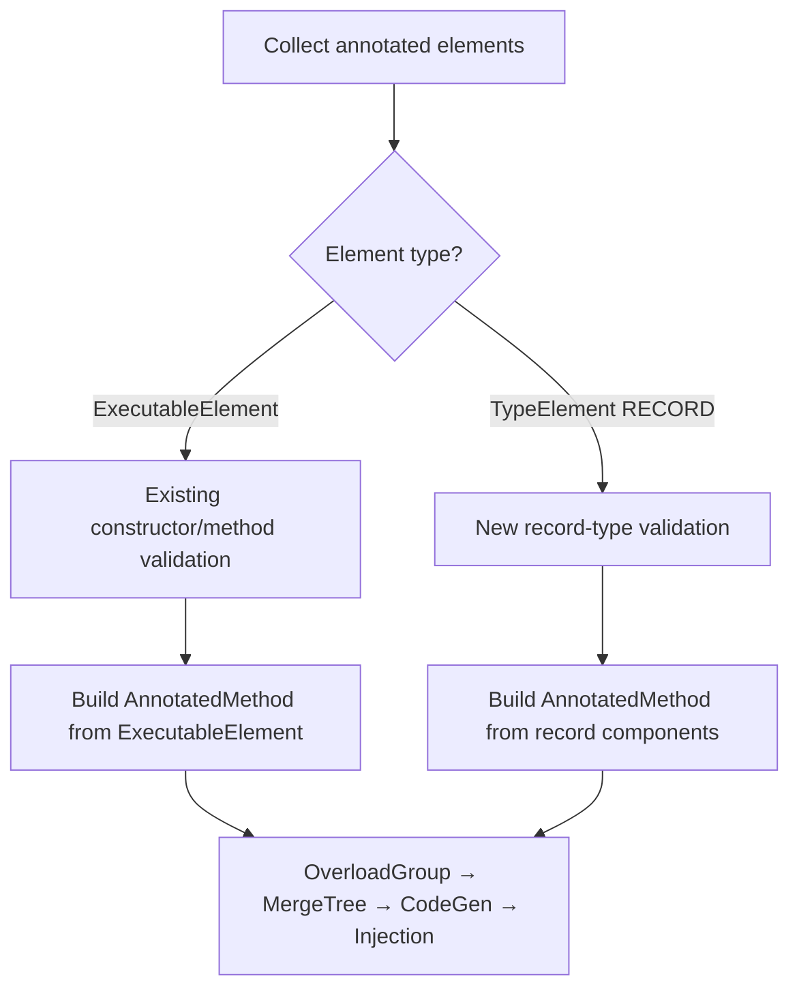

# Design Document: Record Constructor Support

## Overview

This design extends the Rawit annotation processor to support `@Constructor` on Java record type declarations. Today, `@Constructor` targets only `ExecutableElement` (constructors inside classes). This feature adds a second code path: when `@Constructor` appears on a `TypeElement` with `ElementKind.RECORD`, the processor derives the canonical constructor's parameters from the record's components and builds the same `AnnotatedMethod` model that the rest of the pipeline (overload grouping, merge tree, code generation, bytecode injection) already consumes.

The key insight is that the downstream pipeline is model-driven — once a correct `AnnotatedMethod` is constructed, everything from `MergeTreeBuilder` through `JavaPoetGenerator` and `BytecodeInjector` works unchanged. The changes are therefore concentrated in three areas:

1. The `@Constructor` annotation's `@Target` metadata (add `TYPE`)
2. `ElementValidator` — new validation branch for `TypeElement` with kind `RECORD`
3. `RawitAnnotationProcessor.process()` — new branch to handle `TypeElement`, derive parameters from record components, and build `AnnotatedMethod`

## Architecture

The existing processing pipeline is:


With this feature, the pipeline gains a fork at steps B and C:



Steps D through G (OverloadGroup, MergeTreeBuilder, JavaPoetGenerator, BytecodeInjector) are unchanged. The `AnnotatedMethod` record already carries all the fields needed (`isConstructor=true`, `isConstructorAnnotation=true`, `methodName="<init>"`, parameters derived from components).

## Components and Interfaces

### 1. `rawit.Constructor` annotation

Current `@Target`: `ElementType.CONSTRUCTOR`

New `@Target`: `{ElementType.CONSTRUCTOR, ElementType.TYPE}`

No other changes to the annotation. `@Retention(RetentionPolicy.SOURCE)` stays the same.

### 2. `ElementValidator`

A new private method `validateConstructorOnType(Element, Messager)` handles `TypeElement` validation:

```java
private ValidationResult validateConstructorOnType(Element element, Messager messager) {
    // 1. element must be a TypeElement with kind RECORD
    // 2. record must have ≥ 1 record component
    // 3. no existing zero-param static method named "constructor"
}
```

The existing `validateConstructor(Element, Messager)` method is renamed to `validateConstructorOnExecutable` for clarity. The top-level `validate()` dispatch becomes:

```java
if (hasConstructor) {
    if (element instanceof TypeElement te && te.getKind() == ElementKind.RECORD) {
        return validateConstructorOnType(element, messager);
    }
    if (element.getKind() == ElementKind.CONSTRUCTOR) {
        return validateConstructorOnExecutable(element, messager);
    }
    // Not a record type and not a constructor → error
    messager.printMessage(ERROR, "@Constructor on a type is only supported for records", element);
    return ValidationResult.invalid();
}
```

Validation rules for record types:
- Must be `ElementKind.RECORD` (not CLASS, INTERFACE, ENUM)
- Must have ≥ 1 record component (reject zero-component records)
- Must not already have a zero-param static method named `constructor`

The conflict check for records scans `TypeElement.getEnclosedElements()` directly (the record type IS the enclosing element, unlike the constructor case where we look at `exec.getEnclosingElement()`).

### 3. `RawitAnnotationProcessor`

The `process()` method currently casts every annotated element to `ExecutableElement` and skips non-executable elements. The change:

```java
for (final Element element : roundEnv.getElementsAnnotatedWith(annotation)) {
    final ValidationResult result = elementValidator.validate(element, messager);
    if (result instanceof ValidationResult.Invalid) continue;

    if (element instanceof TypeElement typeElement
            && typeElement.getKind() == ElementKind.RECORD) {
        // New record-type path
        final AnnotatedMethod model = buildAnnotatedMethodFromRecord(typeElement);
        if (model != null) validMethods.add(model);
    } else if (element instanceof ExecutableElement exec) {
        // Existing constructor/method path
        final AnnotatedMethod model = buildAnnotatedMethod(exec);
        if (model != null) validMethods.add(model);
    }
}
```

New private method `buildAnnotatedMethodFromRecord(TypeElement)`:

```java
private AnnotatedMethod buildAnnotatedMethodFromRecord(TypeElement recordElement) {
    String enclosingClassName = toBinaryName(recordElement);
    List<Parameter> parameters = new ArrayList<>();
    for (RecordComponentElement comp : recordElement.getRecordComponents()) {
        String name = comp.getSimpleName().toString();
        String descriptor = toTypeDescriptor(comp.asType());
        parameters.add(new Parameter(name, descriptor));
    }
    int accessFlags = resolveRecordAccessFlags(recordElement);
    return new AnnotatedMethod(
        enclosingClassName, "<init>", false, true, true,
        parameters, "V", List.of(), accessFlags);
}
```

Key details:
- `getRecordComponents()` returns components in declaration order (JLS guarantee)
- Type descriptors are derived from `comp.asType()` using the existing `toTypeDescriptor()` method
- `checkedExceptions` is empty — canonical record constructors cannot declare checked exceptions
- Access flags are derived from the record type's modifiers (public record → ACC_PUBLIC)

### 4. Downstream pipeline (unchanged)

- `OverloadGroup`: receives the `AnnotatedMethod` with `methodName="<init>"` and `isConstructorAnnotation=true` — groups correctly
- `MergeTreeBuilder`: builds the merge tree from the single-member group — works as-is
- `InvokerClassSpec`: detects `isConstructorAnnotation()` → generates `Constructor` class with `construct()` terminal — works as-is
- `StageInterfaceSpec`: generates stage interfaces with `StageConstructor` suffix — works as-is
- `TerminalInterfaceSpec`: generates `ConstructStageInvoker` with `construct()` — works as-is
- `BytecodeInjector`: detects `isConstructorAnnotation()` group → injects `public static constructor()` — works as-is

## Data Models

No new data models are introduced. The existing `AnnotatedMethod` record already has all required fields:

| Field | Value for record-type annotation |
|---|---|
| `enclosingClassName` | Binary name of the record, e.g. `"com/example/Point"` |
| `methodName` | `"<init>"` |
| `isStatic` | `false` |
| `isConstructor` | `true` |
| `isConstructorAnnotation` | `true` |
| `parameters` | Derived from record components in declaration order |
| `returnTypeDescriptor` | `"V"` |
| `checkedExceptions` | `List.of()` (canonical constructors can't throw checked exceptions) |
| `accessFlags` | Derived from record type modifiers (typically `0x0001` for public) |

The `Parameter` record is reused as-is — each record component maps to a `Parameter(name, typeDescriptor)`.


## Correctness Properties

*A property is a characteristic or behavior that should hold true across all valid executions of a system — essentially, a formal statement about what the system should do. Properties serve as the bridge between human-readable specifications and machine-verifiable correctness guarantees.*

### Property 1: Record AnnotatedMethod construction correctness

*For any* record type with N ≥ 1 components, building an `AnnotatedMethod` from that record SHALL produce a model where `enclosingClassName` equals the slash-separated binary name of the record, `methodName` equals `"<init>"`, `isConstructor` is `true`, `isConstructorAnnotation` is `true`, and `parameters` is a list of N `Parameter` entries whose names and type descriptors match the record components in declaration order.

**Validates: Requirements 3.2, 3.3, 3.4**

### Property 2: Validation accepts valid records

*For any* `TypeElement` with kind `RECORD` that has at least one record component and no existing zero-parameter static method named `constructor`, the `ElementValidator` SHALL return `ValidationResult.Valid`.

**Validates: Requirements 2.1**

### Property 3: Validation rejects non-record types

*For any* `TypeElement` with kind other than `RECORD` (CLASS, INTERFACE, ENUM) annotated with `@Constructor`, the `ElementValidator` SHALL return `ValidationResult.Invalid` and emit an error diagnostic.

**Validates: Requirements 2.3**

### Property 4: Validation detects constructor() conflict on records

*For any* record type that already declares a zero-parameter static method named `constructor`, the `ElementValidator` SHALL return `ValidationResult.Invalid` and emit an error diagnostic mentioning the conflict.

**Validates: Requirements 2.4**

### Property 5: Type descriptor correctness for record components

*For any* record component type — whether primitive (`int`, `boolean`, etc.), reference (`String`, `List<T>`, etc.), or array (`int[]`, `String[][]`, etc.) — the `toTypeDescriptor()` method SHALL produce the correct JVM type descriptor (`I` for int, `Ljava/lang/String;` for String, `[I` for int[], etc.), with generic types erased to their raw bounds.

**Validates: Requirements 7.1, 7.2, 7.3**

### Property 6: Code generation produces correct staged API for records

*For any* record-derived `AnnotatedMethod` with N parameters, the `JavaPoetGenerator` pipeline SHALL produce a `Constructor` caller class in the same package as the record, containing N stage interfaces with setter methods matching the parameter names in order, and a `ConstructStageInvoker` terminal interface with a `construct()` method returning the record type.

**Validates: Requirements 5.1, 5.2, 5.3**

### Property 7: Bytecode injection produces correct entry point for records

*For any* record whose `.class` file does not already contain a zero-parameter method named `constructor`, the `BytecodeInjector` SHALL inject a `public static constructor()` method whose bytecode instantiates and returns the generated `Constructor` caller class.

**Validates: Requirements 6.1, 6.2**

### Property 8: Injection idempotency

*For any* record whose `.class` file already contains a zero-parameter method named `constructor`, the `BytecodeInjector` SHALL skip injection for that overload group, leaving the existing method unchanged.

**Validates: Requirements 6.3**

### Property 9: Backward compatibility for regular class constructors

*For any* regular (non-record) class constructor annotated with `@Constructor`, the `ElementValidator` SHALL apply the same validation rules as before this feature, and the `RawitAnnotationProcessor` SHALL build the `AnnotatedMethod` using the existing `ExecutableElement`-based code path, producing identical output to the pre-feature behavior.

**Validates: Requirements 1.2, 8.1, 8.2**

### Property 10: Independent processing of records and regular classes

*For any* compilation round containing both a `@Constructor`-annotated record type and a `@Constructor`-annotated regular class constructor, the processor SHALL produce correct `AnnotatedMethod` models for both, and neither SHALL interfere with the other's overload grouping, code generation, or bytecode injection.

**Validates: Requirements 8.3**

### Property 11: Pipeline integration for record-derived AnnotatedMethod

*For any* `AnnotatedMethod` built from a record type, the model SHALL successfully pass through `OverloadGroup` construction, `MergeTreeBuilder.build()`, and `InvokerClassSpec.build()` without errors, producing a valid merge tree and generated source code.

**Validates: Requirements 4.3**

## Error Handling

| Scenario | Diagnostic | Severity |
|---|---|---|
| `@Constructor` on a non-record type (class, interface, enum) | `@Constructor on a type is only supported for records` | ERROR |
| `@Constructor` on a record with zero components | `staged construction requires at least one record component` | ERROR |
| `@Constructor` on a record that already has a `constructor()` method | `a parameterless overload named 'constructor' already exists` | ERROR |
| `.class` file not found during injection phase | Debug NOTE (silent skip) | NOTE |
| Bytecode verification failure after injection | `BytecodeInjector: bytecode verification failed` — original `.class` preserved | ERROR |
| Generated source file already exists (incremental build) | Logged as NOTE, skipped silently | NOTE |

All error diagnostics are emitted via `Messager.printMessage(Diagnostic.Kind.ERROR, ...)` with the offending element attached, so IDEs can highlight the exact annotation location.

The validator checks ALL applicable rules without short-circuiting (consistent with existing behavior), so that every error is surfaced in a single compilation pass.

## Testing Strategy

### Dual Testing Approach

This feature uses both unit tests and property-based tests:

- **Unit tests**: Verify specific examples (e.g., `@Constructor` on `record Point(int x, int y)` produces the expected `AnnotatedMethod`), edge cases (zero-component records, non-record types), and integration scenarios (end-to-end compilation with both records and regular classes).
- **Property-based tests**: Verify universal properties across randomly generated inputs (e.g., for any record with N components, the derived `AnnotatedMethod` has N parameters in order).

### Property-Based Testing Configuration

- **Library**: jqwik (already used in the project)
- **Minimum iterations**: 100 per property test
- **Tag format**: `Feature: record-constructor-support, Property {number}: {property_text}`
- Each correctness property above is implemented by a single `@Property`-annotated test method
- Generators produce random record component lists (varying names, types including primitives, references, arrays, and generics)

### Test Organization

- `ElementValidatorTest` / `ElementValidatorPropertyTest` — extended with record-type validation cases
- `RawitAnnotationProcessorPropertyTest` — extended with record-type AnnotatedMethod construction properties
- `RawitAnnotationProcessorIntegrationTest` — extended with end-to-end record compilation tests
- `BytecodeInjectorTest` / `BytecodeInjectorPropertyTest` — extended with record injection cases
- `InvokerClassSpecTest` / `InvokerClassSpecPropertyTest` — extended with record-derived merge tree code generation

### Key Test Scenarios

1. Valid record with primitive components → successful processing
2. Valid record with mixed types (primitives, references, arrays, generics) → correct type descriptors
3. Zero-component record → validation error
4. Non-record type with `@Constructor` → validation error
5. Record with existing `constructor()` method → conflict error
6. Regular class constructor with `@Constructor` → unchanged behavior (regression)
7. Same compilation round with both record and regular class → independent processing
8. Idempotent injection — running injection twice produces same result
