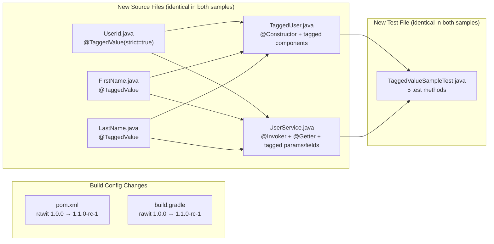

# Design Document: Sample Tagged Value Demo

## Overview

This feature updates the existing Maven and Gradle sample projects to demonstrate the `@TaggedValue` annotation introduced in rawit `1.1.0-rc-1`. The update involves three categories of changes:

1. **Version bump**: Both `pom.xml` and `build.gradle` update the rawit dependency from `1.0.0` to `1.1.0-rc-1`
2. **New source files**: Six new Java files are added to `com.example.model` — three tag annotation declarations (`UserId.java`, `FirstName.java`, `LastName.java`), a tagged record (`TaggedUser.java`), and a service class demonstrating `@Invoker` + `@Getter` with tagged parameters/fields (`UserService.java`)
3. **New test file**: `TaggedValueSampleTest.java` with JUnit 5 tests covering constructor chains with literals, constructor chains with tagged variables, invoker chains with tagged variables, getter on tagged fields, and record accessor methods

All existing files (`Calculator.java`, `Point.java`, `Coord.java`, `User.java`, `RawitSampleTest.java`) remain unmodified. All new Java source files are byte-for-byte identical between the Maven and Gradle samples.

### Design Rationale

- **Separate test file**: The new `TaggedValueSampleTest.java` is kept separate from the existing `RawitSampleTest.java` to preserve the existing sample functionality untouched (Requirement 11) while cleanly organizing the new `@TaggedValue` demonstrations.
- **UserService dual-purpose**: The `UserService` class demonstrates both `@Invoker` with tagged parameters (Requirement 4) and `@Getter` with tagged fields (Requirement 5) in a single class, keeping the sample concise while covering both use cases.
- **Tag annotation files are minimal**: Each tag annotation is its own file (standard Java convention for public types) with a descriptive comment explaining strict vs. lax mode.

## Architecture

### Directory Layout (New Files Only)

```
samples/
├── maven-sample/
│   ├── pom.xml                          # MODIFIED: version 1.0.0 → 1.1.0-rc-1
│   └── src/
│       ├── main/java/com/example/model/
│       │   ├── Calculator.java          # UNCHANGED
│       │   ├── Coord.java               # UNCHANGED
│       │   ├── Point.java               # UNCHANGED
│       │   ├── User.java                # UNCHANGED
│       │   ├── UserId.java              # NEW: @TaggedValue(strict = true)
│       │   ├── FirstName.java           # NEW: @TaggedValue (lax)
│       │   ├── LastName.java            # NEW: @TaggedValue (lax)
│       │   ├── TaggedUser.java          # NEW: @Constructor record with tagged components
│       │   └── UserService.java         # NEW: @Invoker + @Getter with tagged params/fields
│       └── test/java/com/example/
│           ├── RawitSampleTest.java          # UNCHANGED
│           └── TaggedValueSampleTest.java    # NEW: JUnit 5 tests for tagged value demos
└── gradle-sample/
    ├── build.gradle                     # MODIFIED: version 1.0.0 → 1.1.0-rc-1
    └── src/                             # All Java files identical to maven-sample
```

### Change Flow



## Components and Interfaces

### 1. `UserId.java` — Strict Tag Annotation

```java
package com.example.model;

import rawit.TaggedValue;

/**
 * Tag annotation for user ID values.
 * Strict mode: warns on tagged↔untagged assignments (except literals/constants).
 */
@TaggedValue(strict = true)
public @interface UserId { }
```

### 2. `FirstName.java` — Lax Tag Annotation

```java
package com.example.model;

import rawit.TaggedValue;

/**
 * Tag annotation for first name values.
 * Lax mode (default): only warns on tag mismatches between different tags.
 */
@TaggedValue
public @interface FirstName { }
```

### 3. `LastName.java` — Lax Tag Annotation

```java
package com.example.model;

import rawit.TaggedValue;

/**
 * Tag annotation for last name values.
 * Lax mode (default): only warns on tag mismatches between different tags.
 */
@TaggedValue
public @interface LastName { }
```

### 4. `TaggedUser.java` — Tagged Record with @Constructor

```java
package com.example.model;

import rawit.Constructor;

/**
 * Demonstrates @Constructor combined with tag annotations on record components.
 * The generated builder chain propagates tag annotations onto stage method parameters,
 * enabling compile-time tag safety through the fluent API.
 */
@Constructor
public record TaggedUser(@UserId long userId, @FirstName String firstName, @LastName String lastName) { }
```

This generates a staged builder chain where each stage method parameter carries the corresponding tag annotation:
- `.userId(@UserId long userId)` — strict tagged
- `.firstName(@FirstName String firstName)` — lax tagged
- `.lastName(@LastName String lastName)` — lax tagged

### 5. `UserService.java` — @Invoker + @Getter with Tagged Params/Fields

```java
package com.example.model;

import rawit.Getter;
import rawit.Invoker;

/**
 * Demonstrates @Invoker with tagged method parameters and @Getter with tagged fields.
 */
public class UserService {

    @Getter @FirstName private String currentFirstName;
    @Getter @LastName private String currentLastName;

    @Invoker
    public String formatName(@FirstName String firstName, @LastName String lastName) {
        this.currentFirstName = firstName;
        this.currentLastName = lastName;
        return firstName + " " + lastName;
    }
}
```

This class serves two purposes:
- **@Invoker demo** (Requirement 4): `formatName` generates a staged call chain `.firstName("John").lastName("Doe").invoke()` with tagged parameters
- **@Getter demo** (Requirement 5): `currentFirstName` and `currentLastName` fields have both `@Getter` and a tag annotation, so the generated getters (`getCurrentFirstName()`, `getCurrentLastName()`) return tagged values

### 6. `TaggedValueSampleTest.java` — JUnit 5 Tests

```java
package com.example;

import com.example.model.FirstName;
import com.example.model.LastName;
import com.example.model.TaggedUser;
import com.example.model.UserId;
import com.example.model.UserService;
import org.junit.jupiter.api.Test;

import static org.junit.jupiter.api.Assertions.*;

class TaggedValueSampleTest {

    @Test
    void taggedConstructorWithLiterals() {
        TaggedUser user = TaggedUser.constructor()
                .userId(42)
                .firstName("John")
                .lastName("Doe")
                .construct();
        assertEquals(42, user.userId());
        assertEquals("John", user.firstName());
        assertEquals("Doe", user.lastName());
    }

    @Test
    void taggedConstructorWithTaggedVariables() {
        @UserId long id = 99;
        @FirstName String first = "Jane";
        @LastName String last = "Smith";
        TaggedUser user = TaggedUser.constructor()
                .userId(id)
                .firstName(first)
                .lastName(last)
                .construct();
        assertEquals(99, user.userId());
        assertEquals("Jane", user.firstName());
        assertEquals("Smith", user.lastName());
    }

    @Test
    void taggedInvokerChain() {
        UserService service = new UserService();
        @FirstName String first = "Alice";
        @LastName String last = "Wonder";
        String result = service.formatName().firstName(first).lastName(last).invoke();
        assertEquals("Alice Wonder", result);
    }

    @Test
    void taggedGetterOnFields() {
        UserService service = new UserService();
        service.formatName().firstName("Bob").lastName("Builder").invoke();
        assertEquals("Bob", service.getCurrentFirstName());
        assertEquals("Builder", service.getCurrentLastName());
    }

    @Test
    void taggedRecordAccessors() {
        TaggedUser user = TaggedUser.constructor()
                .userId(1)
                .firstName("Carol")
                .lastName("Danvers")
                .construct();
        assertEquals(1, user.userId());
        assertEquals("Carol", user.firstName());
        assertEquals("Danvers", user.lastName());
    }
}
```

### 7. Build File Changes

#### Maven `pom.xml` — Version Bump

The only change is updating the rawit dependency version:

```xml
<dependency>
    <groupId>io.github.projectrawit</groupId>
    <artifactId>rawit</artifactId>
    <version>1.1.0-rc-1</version>
</dependency>
```

#### Gradle `build.gradle` — Version Bump

Both dependency declarations are updated:

```groovy
dependencies {
    annotationProcessor 'io.github.projectrawit:rawit:1.1.0-rc-1'
    compileOnly 'io.github.projectrawit:rawit:1.1.0-rc-1'

    testImplementation 'org.junit.jupiter:junit-jupiter:5.11.4'
}
```

## Data Models

This feature introduces no new runtime data models. The new classes are demonstration artifacts:

| Class | Type | Purpose |
|---|---|---|
| `UserId` | Annotation | Tag annotation with `strict = true` for user ID values |
| `FirstName` | Annotation | Tag annotation with lax mode for first name values |
| `LastName` | Annotation | Tag annotation with lax mode for last name values |
| `TaggedUser` | Record | `@Constructor` record with three tagged components (`@UserId long`, `@FirstName String`, `@LastName String`) |
| `UserService` | Class | `@Invoker` method with tagged parameters + `@Getter` fields with tag annotations |

### Build Dependency Changes

| Artifact | Old Version | New Version | Scope (Maven) | Configuration (Gradle) |
|---|---|---|---|---|
| `io.github.projectrawit:rawit` | `1.0.0` | `1.1.0-rc-1` | `compile` | `annotationProcessor` + `compileOnly` |
| `org.junit.jupiter:junit-jupiter` | `5.11.4` | `5.11.4` (unchanged) | `test` | `testImplementation` |


## Correctness Properties

*A property is a characteristic or behavior that should hold true across all valid executions of a system — essentially, a formal statement about what the system should do. Properties serve as the bridge between human-readable specifications and machine-verifiable correctness guarantees.*

### Prework Summary

This feature is primarily about creating specific files with specific content in two sample projects. Most acceptance criteria are verifiable as concrete examples (does this file exist? does it contain this annotation?). The compilation and runtime criteria (13.1, 13.2) require actually running the build tools and are integration tests.

After analyzing all acceptance criteria, the following properties emerge:

- **File identity**: Many requirements (2.4, 3.3, 4.3, 5.2, 6.3, 7.3, 8.3, 9.2, 10.2, 11.3) require specific files to be identical between samples. These are all subsumed by Requirement 12.1 — the universal property that ALL shared Java source files are byte-for-byte identical.
- **File set equality**: Requirement 12.2 requires both samples to contain the same set of Java source files. This complements the identity property.
- **Build config version**: Requirements 1.1 and 1.2 check that build files reference the correct rawit version. This can be expressed as a property over the set of required config elements.

After reflection, the individual file identity checks (2.4, 3.3, 4.3, etc.) are all redundant with the universal file identity property (12.1). They are consolidated into a single property.

### Property 1: Source file identity and completeness across samples

*For any* Java source file that exists under `samples/maven-sample/src/` or `samples/gradle-sample/src/`, the corresponding file at the same relative path shall exist in the other sample, and the file content shall be byte-for-byte identical.

**Validates: Requirements 2.4, 3.3, 4.3, 5.2, 6.3, 7.3, 8.3, 9.2, 10.2, 11.3, 12.1, 12.2**

### Property 2: Build files reference correct rawit version

*For any* build configuration file in the set {`samples/maven-sample/pom.xml`, `samples/gradle-sample/build.gradle`}, the file shall contain the rawit version string `1.1.0-rc-1` and shall not contain the old version string `1.0.0` as a rawit dependency version.

**Validates: Requirements 1.1, 1.2**

## Error Handling

Since the sample projects are static file artifacts (not runtime code), error handling is minimal:

| Condition | Handling |
|---|---|
| Rawit `1.1.0-rc-1` not available on Maven Central or Maven Local | Build fails with dependency resolution error — expected, as the artifact must be published or installed locally first |
| Java version < 17 | Build fails with compiler error — both build configs enforce Java 17 |
| Tag annotations not on classpath | Compilation fails because `@UserId`, `@FirstName`, `@LastName` reference `rawit.TaggedValue` which is in the rawit dependency |
| Existing tests break after version bump | Unlikely since rawit maintains backward compatibility; existing `@Invoker`, `@Constructor`, `@Getter` behavior is unchanged in 1.1.0-rc-1 |

The test class (`TaggedValueSampleTest.java`) uses standard JUnit 5 assertions. Test failures produce clear messages indicating which staged call chain or accessor produced an unexpected result.

## Testing Strategy

### Dual Testing Approach

- **Unit tests** (JUnit 5): Verify specific examples — file existence, file content, build configuration correctness
- **Property tests** (jqwik): Verify universal properties — source file identity across samples, build config version correctness

Both are complementary: unit tests catch concrete content issues, property tests ensure the two samples stay in sync.

### Property-Based Testing Library

Use **jqwik** (already used in the parent project) for property tests. Each property test runs a minimum of **100 iterations** where applicable. For file-identity checks, the iteration count equals the number of shared source files.

Each property test is tagged with a comment in the format:
`// Feature: sample-tagged-value-demo, Property N: <property text>`

### Property Test Coverage

| Property | Test |
|---|---|
| Property 1: Source file identity and completeness | Enumerate all `.java` files under `samples/maven-sample/src/`, verify each has an identical counterpart under `samples/gradle-sample/src/`, and vice versa |
| Property 2: Build files reference correct version | For each build file, verify it contains `1.1.0-rc-1` and does not reference `1.0.0` as a rawit version |

### Unit Test Coverage

Unit tests verify the example-based acceptance criteria:

- **Tag annotation declarations**: `UserId.java` contains `@TaggedValue(strict = true)` with strict-mode comment; `FirstName.java` and `LastName.java` contain `@TaggedValue` with lax-mode comment
- **TaggedUser record**: Contains `@Constructor`, has three tagged components (`@UserId long userId`, `@FirstName String firstName`, `@LastName String lastName`)
- **UserService class**: Contains `@Invoker` method with `@FirstName` and `@LastName` parameters; contains `@Getter` fields with tag annotations
- **TaggedValueSampleTest content**: Contains test methods for constructor with literals, constructor with tagged variables, invoker chain, getter on tagged fields, record accessors
- **Existing files preserved**: `Calculator.java`, `Point.java`, `Coord.java`, `User.java`, `RawitSampleTest.java` exist and are unmodified
- **Build file version**: `pom.xml` contains rawit `1.1.0-rc-1`; `build.gradle` contains rawit `1.1.0-rc-1` as both `annotationProcessor` and `compileOnly`

### Integration Testing (Manual / CI)

The following are verified by actually running the builds:

- `cd samples/maven-sample && mvn clean test` passes (Requirement 13.1)
- `cd samples/gradle-sample && gradle clean test` passes (Requirement 13.2)

These are not automated as unit/property tests because they require Maven/Gradle tooling and network access to Maven Central or a local Maven repository with rawit `1.1.0-rc-1` installed.
