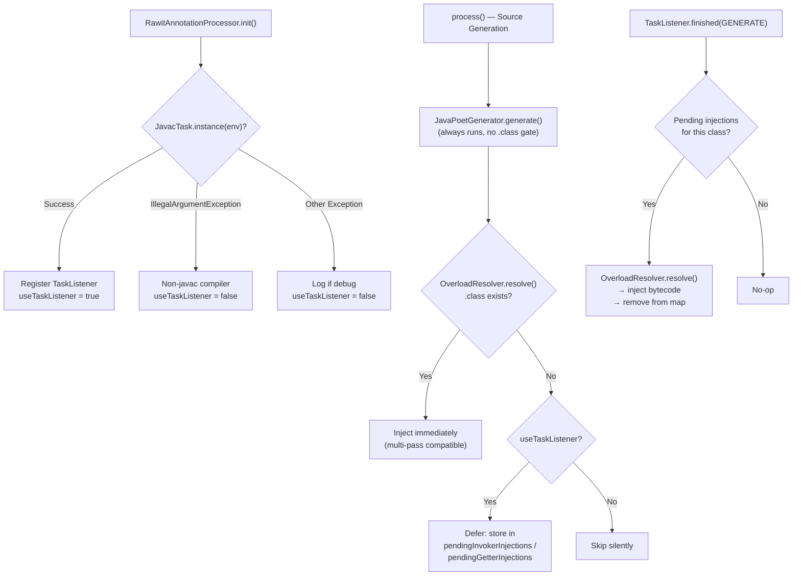

# Design Document: Single-Pass Compilation

## Overview

This design enables single-pass compilation for the Rawit annotation processor by leveraging javac's `TaskListener` API. Previously, bytecode injection required multi-pass compiler configuration (compile → process → recompile) because the processor needed `.class` files to exist on disk before it could inject parameterless overloads and getter methods. With single-pass compilation, the processor defers bytecode injection until after javac writes each `.class` file (the GENERATE phase), eliminating multi-pass build setups entirely.

The approach is non-invasive: the existing `RawitAnnotationProcessor` gains three new fields (`pendingInvokerInjections`, `pendingGetterInjections`, `useTaskListener`), a TaskListener factory method, and three-way branching in the injection logic. The `OverloadResolver` gains a `resolvePath()` method that returns the expected `.class` file path without checking existence. Source file generation (JavaPoet) remains completely independent of `.class` file existence — only bytecode injection is gated.

The processor falls back gracefully to multi-pass mode when running under non-javac compilers (e.g., ECJ) by catching `IllegalArgumentException` from `JavacTask.instance()`.

## Architecture

The single-pass compilation feature modifies the existing annotation processing pipeline by inserting a deferred injection path between source generation and bytecode injection:



### Key Design Decisions

1. **TaskListener over compiler plugin hooks**: javac's `TaskListener` API is the standard mechanism for post-compilation callbacks. It fires per-class after the GENERATE phase, guaranteeing the `.class` file exists on disk when the callback runs.

2. **Three-way branching**: The injection logic uses three branches — immediate (file exists), deferred (file missing + TaskListener), and skip (file missing + no TaskListener). This preserves full backward compatibility with multi-pass setups while enabling single-pass for javac users.

3. **`Map.merge()` for accumulation**: Pending injections use `Map.merge()` with list concatenation to handle multiple overload groups or getter fields targeting the same enclosing class across processing rounds.

4. **`Map.remove()` for consumption**: The TaskListener uses `remove()` to atomically retrieve and clear pending injections, preventing duplicate injection and freeing memory.

5. **`resolvePath()` without existence check**: The `OverloadResolver` gains a `resolvePath()` method that returns the expected path without `Files.exists()`. The existing `resolve()` delegates to `resolvePath().filter(Files::exists)`, preserving backward compatibility. The TaskListener uses `resolve()` (with existence check) since the file is guaranteed to exist after GENERATE.

6. **Source generation independence**: `JavaPoetGenerator.generate()` runs for all valid MergeTrees regardless of `.class` file existence. javac automatically compiles the generated source files in the same invocation. Only bytecode injection is gated on file existence or deferred.

## Components and Interfaces

### 1. `RawitAnnotationProcessor` — Modified Fields

Three new fields support deferred injection:

```java
/** Pending invoker/constructor injections deferred until the GENERATE phase. */
private final Map<String, List<MergeTree>> pendingInvokerInjections = new LinkedHashMap<>();

/** Pending getter injections deferred until the GENERATE phase. */
private final Map<String, List<AnnotatedField>> pendingGetterInjections = new LinkedHashMap<>();

/**
 * true when a TaskListener was successfully registered on the underlying
 * JavacTask, enabling single-pass deferred injection.
 */
private boolean useTaskListener = false;
```

Keys are binary class names (slash-separated, e.g. `"com/example/Foo"`). `LinkedHashMap` preserves insertion order for deterministic processing.

### 2. `RawitAnnotationProcessor.init()` — TaskListener Registration

The `init()` method attempts to register a TaskListener after standard initialization:

```java
try {
    final JavacTask javacTask = JavacTask.instance(processingEnv);
    javacTask.addTaskListener(createPostGenerateListener());
    useTaskListener = true;
} catch (final IllegalArgumentException ignored) {
    // Not running under javac — fall back to multi-pass
} catch (final Exception e) {
    // Unexpected error — log if debug, fall back to multi-pass
}
```

The two-catch pattern distinguishes expected non-javac environments (`IllegalArgumentException`) from unexpected failures (generic `Exception`), logging the latter only when `invoker.debug=true`.

### 3. `RawitAnnotationProcessor.createPostGenerateListener()` — TaskListener Factory

Returns a `TaskListener` that fires on GENERATE events:

```java
private TaskListener createPostGenerateListener() {
    return new TaskListener() {
        @Override
        public void finished(final TaskEvent e) {
            if (e.getKind() != TaskEvent.Kind.GENERATE) return;
            final TypeElement typeElement = e.getTypeElement();
            if (typeElement == null) return;

            final String binaryName = toBinaryName(typeElement);

            // Process getter injections first
            final List<AnnotatedField> fields = pendingGetterInjections.remove(binaryName);
            if (fields != null) {
                overloadResolver.resolve(binaryName, processingEnv)
                    .ifPresent(path -> getterBytecodeInjector.inject(path, fields, processingEnv));
            }

            // Process invoker/constructor injections
            final List<MergeTree> trees = pendingInvokerInjections.remove(binaryName);
            if (trees != null) {
                overloadResolver.resolve(binaryName, processingEnv)
                    .ifPresent(path -> bytecodeInjector.inject(path, trees, processingEnv));
            }
        }
    };
}
```

### 4. Three-Way Injection Branching in `process()`

Both `@Invoker`/`@Constructor` and `@Getter` processing use the same branching pattern:

```java
final Optional<Path> classFilePath = overloadResolver.resolve(enclosingClassName, processingEnv);
if (classFilePath.isPresent()) {
    // File exists — inject immediately (multi-pass compatible)
    bytecodeInjector.inject(classFilePath.get(), classTrees, processingEnv);
} else if (useTaskListener) {
    // File not yet written — defer until GENERATE phase
    pendingInvokerInjections.merge(enclosingClassName, new ArrayList<>(classTrees), (a, b) -> {
        a.addAll(b);
        return a;
    });
} else {
    // No TaskListener, no .class file — skip silently
}
```

### 5. `OverloadResolver` — New `resolvePath()` Method

```java
/**
 * Resolves the target .class file path without checking Files.exists().
 * Returns where the .class file will be written when compilation finishes.
 */
public Optional<Path> resolvePath(String binaryClassName, ProcessingEnvironment env) {
    try {
        String packageName = toPackageName(binaryClassName);
        String simpleName = toSimpleName(binaryClassName) + ".class";
        FileObject resource = env.getFiler().getResource(
            StandardLocation.CLASS_OUTPUT, packageName, simpleName);
        URI uri = resource.toUri();
        if (!"file".equalsIgnoreCase(uri.getScheme())) {
            return Optional.empty();
        }
        return Optional.of(Paths.get(uri));
    } catch (IOException | IllegalArgumentException e) {
        return Optional.empty();
    }
}

/** Existing method — now delegates to resolvePath with existence check. */
public Optional<Path> resolve(String binaryClassName, ProcessingEnvironment env) {
    return resolvePath(binaryClassName, env).filter(Files::exists);
}
```

### 6. Build Configuration Changes

**Maven sample** (`samples/maven-sample/pom.xml`): Standard `maven-compiler-plugin` with `<release>17</release>`. No multi-pass execution blocks.

**Gradle sample** (`samples/gradle-sample/build.gradle`): Standard `annotationProcessor` and `compileOnly` dependency declarations. No custom `processAnnotations` or `reinjectBytecode` tasks.

**README**: Documents that no multi-pass configuration is needed — "Rawit hooks into javac's post-generate phase via a `TaskListener` and injects bytecode after each `.class` file is written."

## Data Models

### Pending Injection Maps

```
pendingInvokerInjections: Map<String, List<MergeTree>>
  Key:   binary class name (slash-separated), e.g. "com/example/Foo"
  Value: list of MergeTree objects for @Invoker/@Constructor overload groups

pendingGetterInjections: Map<String, List<AnnotatedField>>
  Key:   binary class name (slash-separated), e.g. "com/example/Foo"
  Value: list of AnnotatedField objects for @Getter fields
```

Both maps use `LinkedHashMap` for deterministic iteration order. Entries are added via `Map.merge()` during `process()` and consumed via `Map.remove()` in the TaskListener.

### TaskEvent Data Flow

```
TaskEvent (GENERATE phase)
  └── TypeElement (the class that was just compiled)
       └── toBinaryName() → "com/example/Foo"
            ├── pendingGetterInjections.remove("com/example/Foo") → List<AnnotatedField>?
            │    └── overloadResolver.resolve() → Path → getterBytecodeInjector.inject()
            └── pendingInvokerInjections.remove("com/example/Foo") → List<MergeTree>?
                 └── overloadResolver.resolve() → Path → bytecodeInjector.inject()
```

### OverloadResolver Method Relationship

```
resolvePath(binaryClassName, env) → Optional<Path>   // no existence check
    ↑
resolve(binaryClassName, env) → Optional<Path>        // delegates + Files.exists filter
```

## Correctness Properties

*A property is a characteristic or behavior that should hold true across all valid executions of a system — essentially, a formal statement about what the system should do. Properties serve as the bridge between human-readable specifications and machine-verifiable correctness guarantees.*

### Property 1: Pending injection merge accumulates all entries

*For any* sequence of `MergeTree` lists (or `AnnotatedField` lists) targeting the same binary class name, merging them into the pending injections map via `Map.merge()` with list concatenation shall produce a single list containing all entries from all input lists, in order.

**Validates: Requirements 2.4, 3.4**

### Property 2: TaskListener only responds to GENERATE events

*For any* `TaskEvent` with a kind other than `GENERATE`, the TaskListener shall not invoke any bytecode injector and shall not modify the pending injection maps.

**Validates: Requirements 4.4**

### Property 3: TaskListener removes pending entries after processing

*For any* binary class name present in the pending injections map, after the TaskListener processes a `GENERATE` event for that class, the pending injections map shall no longer contain an entry for that class name.

**Validates: Requirements 4.5**

### Property 4: resolvePath returns path without existence check

*For any* valid binary class name that maps to a `file:` URI via the Filer API, `resolvePath()` shall return a non-empty `Optional<Path>` regardless of whether the file exists on disk. The returned path shall end with `{simpleName}.class`.

**Validates: Requirements 5.1**

### Property 5: resolve delegates to resolvePath with existence filter

*For any* binary class name, `resolve(name, env)` shall return the same result as `resolvePath(name, env).filter(Files::exists)`.

**Validates: Requirements 5.2**

### Property 6: Bytecode equivalence between immediate and deferred injection

*For any* annotated source file compiled with the Rawit processor, the `.class` file produced by immediate injection (multi-pass mode) shall be functionally equivalent to the `.class` file produced by deferred injection (single-pass mode) — both shall contain the same injected methods with identical signatures and behavior.

**Validates: Requirements 8.3**

## Error Handling

### TaskListener Registration Failures

| Condition | Behavior |
|---|---|
| `IllegalArgumentException` from `JavacTask.instance()` | Caught silently. `useTaskListener` remains `false`. Processor continues in multi-pass mode. |
| Generic `Exception` during registration | Caught. If `invoker.debug=true`, a `NOTE` diagnostic is emitted with the exception class and message. `useTaskListener` remains `false`. |

### Deferred Injection Edge Cases

| Condition | Behavior |
|---|---|
| `.class` file missing + `useTaskListener=true` | Injection deferred to pending map. |
| `.class` file missing + `useTaskListener=false` | Injection skipped silently. No error emitted. |
| TaskListener fires but `resolve()` returns empty | Injection skipped for that class (e.g., non-file URI scheme). No error emitted. |
| Multiple overload groups for same class | Lists merged via `Map.merge()` — all groups injected together. |

### OverloadResolver Error Handling

| Condition | Behavior |
|---|---|
| `IOException` during `Filer.getResource()` | `resolvePath()` returns `Optional.empty()`. |
| `IllegalArgumentException` during URI conversion | `resolvePath()` returns `Optional.empty()`. |
| Non-`file:` URI scheme (e.g., `jar:`, `mem:`) | `resolvePath()` returns `Optional.empty()`. |

All error handling follows the existing pattern: errors during bytecode injection are emitted as `ERROR` diagnostics via `Messager`, and the original `.class` file is preserved.

## Testing Strategy

### Property-Based Testing

The project uses **jqwik** (already in `pom.xml`) for property-based testing. Each correctness property maps to a single `@Property` test method with a minimum of 100 tries.

Each property test must be tagged with a comment:
```java
// Feature: single-pass-compilation, Property N: <property text>
```

Key property tests:

1. **Pending injection merge test** (Property 1) — Generate random sequences of `MergeTree` lists and `AnnotatedField` lists for the same class name. Apply `Map.merge()` with list concatenation. Verify the merged list contains all entries in order.

2. **TaskListener event filtering test** (Property 2) — Generate random `TaskEvent.Kind` values. For non-GENERATE kinds, verify the listener does not invoke injectors or modify pending maps.

3. **TaskListener consume-on-remove test** (Property 3) — Populate pending maps with random entries. Fire GENERATE events. Verify entries are removed after processing.

4. **resolvePath without existence check test** (Property 4) — Generate random valid binary class names. Verify `resolvePath()` returns a path ending with the correct `.class` filename, without checking file existence.

5. **resolve delegates to resolvePath test** (Property 5) — Generate random binary class names. Verify `resolve()` equals `resolvePath().filter(Files::exists)`.

6. **Bytecode equivalence test** (Property 6) — Compile annotated sources in both multi-pass and single-pass modes. Compare the resulting `.class` files for functional equivalence (same injected methods with identical signatures).

### Unit Testing

Unit tests complement property tests for specific examples and edge cases:

- **TaskListener registration tests** — Verify `useTaskListener` is set correctly under javac, non-javac (IllegalArgumentException), and unexpected exception scenarios.
- **Three-way branching tests** — Verify immediate injection when `.class` exists, deferred injection when `useTaskListener=true`, and skip when both are false.
- **OverloadResolver.resolvePath tests** — Specific examples: valid class name returns path, non-file URI returns empty, IOException returns empty.

### Integration Testing

Integration tests verify end-to-end single-pass compilation:

- **`compileSinglePassAndLoad` helper** — Compiles source with the processor in a single javac invocation (no multi-pass setup).
- **Instance @Invoker** — Single-pass compile, verify `add().x(3).y(4).invoke() == 7`.
- **Static @Invoker** — Single-pass compile, verify `add().x(5).y(6).invoke() == 11`.
- **@Constructor** — Single-pass compile, verify `constructor().x(1).y(2).construct()` creates correct instance.
- **@Getter** — Single-pass compile, verify `getName()` and `getAge()` return correct values.
- **Multi-pass backward compatibility** — Existing multi-pass integration tests continue to pass unchanged.

