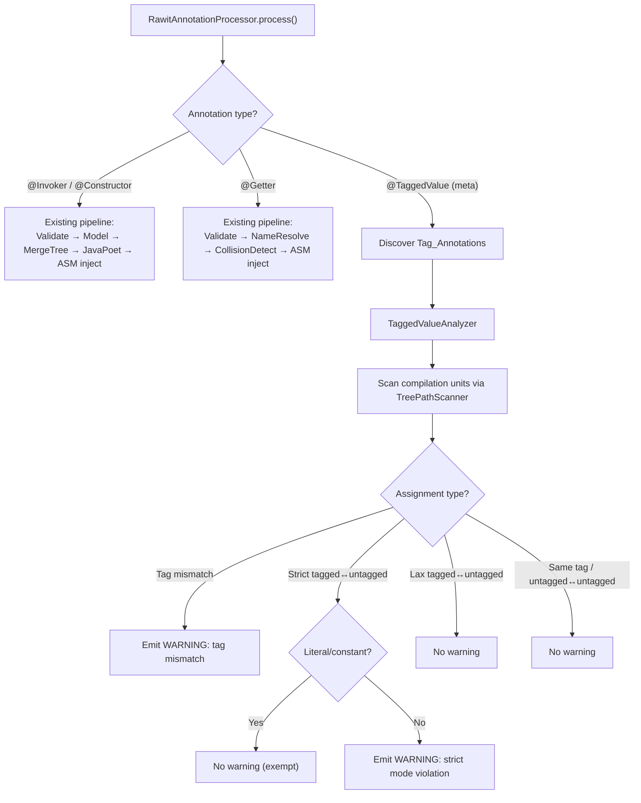

# Design Document: @TaggedValue Annotation

## Overview

This design adds a `@TaggedValue` meta-annotation to the rawit library that enables lightweight, compile-time value type safety without wrapper types. Users annotate their own annotation declarations with `@TaggedValue` to create "tag annotations" (e.g., `@UserId`, `@FirstName`, `@LastName`). A `TaggedValueAnalyzer` component, integrated into the existing `RawitAnnotationProcessor`, inspects assignments involving tagged elements and emits compiler warnings for unsafe operations:

- **Tag mismatch**: Always warns when assigning a value tagged with `@A` to a target tagged with `@B` (regardless of strict/lax mode).
- **Strict mode** (`strict = true`): Warns on tagged→untagged and untagged→tagged assignments (but NOT for literals/constants).
- **Lax mode** (`strict = false`, the default): No warnings for tagged↔untagged assignments.
- **Literals/constants**: Always exempt from untagged→tagged warnings in strict mode.
- **Multiple tags**: Uses the first tag annotation encountered; warns about duplicates.

The analyzer operates within the same compilation round as existing annotation processing — no additional compiler passes are required. It leverages the `com.sun.source.tree` API (javac Tree API) to inspect assignment expressions, method arguments, and return statements at the AST level.

### Design Rationale

The key design decision is to use the javac Tree API (`com.sun.source.util.TreePathScanner`) rather than pure `javax.lang.model` element inspection. This is necessary because:

1. **Assignment analysis requires AST access**: The `javax.lang.model` API provides type and element information but does not expose assignment expressions, local variable initializers, or method call arguments. The Tree API provides the AST nodes needed to detect value flows between tagged and untagged elements.
2. **Literal detection**: Determining whether a source expression is a literal or compile-time constant requires inspecting the AST node type (`LiteralTree`, `IdentifierTree` referencing a `static final` field with a constant value).
3. **Consistency with existing architecture**: The processor already uses `JavacTask` and `TaskListener` for single-pass compilation support. The Tree API integrates naturally with this approach.

## Architecture

The `@TaggedValue` processing pipeline integrates into the existing `RawitAnnotationProcessor` as a new analysis path alongside `@Invoker`, `@Constructor`, and `@Getter`:



### Processing Phases

1. **Discovery**: During `process()`, the processor collects all annotation types that are themselves annotated with `@TaggedValue`. These become the known tag annotations for the current round. For each discovered tag annotation, the processor reads the `strict` attribute value.
2. **Tag Map Construction**: A `Map<String, TagInfo>` is built mapping each tag annotation's fully qualified name to its `strict` flag. This map is passed to the `TaggedValueAnalyzer`.
3. **AST Analysis**: The `TaggedValueAnalyzer` uses a `TreePathScanner` (registered via the existing `JavacTask` integration) to walk compilation units and inspect:
   - Variable declarations with initializers (local variables, fields)
   - Assignment expressions
   - Method invocation arguments (including generated builder chain stage methods)
   - Return statements
4. **Tag Resolution**: For each source and target in an assignment-like expression, the analyzer resolves the effective tag by inspecting annotations on the element (variable, parameter, field, method return type).
5. **Warning Emission**: Based on the tag resolution results and the strict/lax mode of the involved tags, the analyzer emits `Diagnostic.Kind.WARNING` messages via the `Messager`.

### Integration with Generated Builder Chains

When `@Constructor` or `@Invoker` generates stage methods (e.g., `.userId(10).firstName("John")`), the tag annotations on the original constructor/method parameters are **propagated onto the generated stage method parameters** in the emitted source code. The `TaggedValueAnalyzer` then inspects the arguments passed to these stage methods and applies the same tag-checking rules using the tag on the generated parameter as the target tag — no special mapping from generated methods back to originals is needed.

This works through a multi-layer propagation pipeline:

1. **Capture**: `RawitAnnotationProcessor.buildAnnotatedMethod()` and `buildAnnotatedMethodFromRecord()` extract tag annotation FQNs from each parameter's annotations and store them in the `Parameter` model's new `annotationFqns` field.
2. **Carry**: The `Parameter` model flows through `AnnotatedMethod` → `MergeTreeBuilder` → `MergeNode` (SharedNode/Branch carry `paramName`, `typeDescriptor`, and now the annotation FQNs via the `Parameter` reference). The `MergeNode.SharedNode` and `MergeNode.Branch` records are extended to carry a `List<String> annotationFqns` alongside the existing `paramName` and `typeDescriptor`.
3. **Emit**: `StageInterfaceSpec.buildStageMethod()` reads the annotation FQNs from the node and adds `@AnnotationSpec` entries to the generated `ParameterSpec` for each FQN. This produces generated source like:
   ```java
   public interface UserIdStageConstructor {
       FirstNameStageConstructor userId(@UserId long userId);
   }
   ```
4. **Analyze**: The `TaggedValueAnalyzer`'s existing `visitMethodInvocation` handler resolves the target tag by inspecting the called method's parameter annotations. Since the generated stage method parameters now carry `@UserId`, `@FirstName`, etc., the analyzer detects tag violations at the call site without any special-case logic.

## Components and Interfaces

### 1. `rawit.TaggedValue` — Meta-Annotation Declaration

```java
@Target(ElementType.ANNOTATION_TYPE)
@Retention(RetentionPolicy.CLASS)
public @interface TaggedValue {
    boolean strict() default false;
}
```

Targets annotation type declarations only. `CLASS` retention ensures the tag metadata is available during annotation processing of downstream code that uses the tag annotations. This differs from `@Invoker`/`@Constructor`/`@Getter` which use `SOURCE` retention — `@TaggedValue` must survive into the `.class` file so that downstream projects can recognize tag annotations from library dependencies.

### 2. `rawit.processors.model.TagInfo` — Tag Metadata Record

```java
public record TagInfo(
    String annotationFqn,  // e.g. "com.example.UserId"
    boolean strict         // true for strict mode, false for lax
) {}
```

Lightweight model capturing the metadata for a single tag annotation. Built during the discovery phase and stored in the tag map.

### 3. `rawit.processors.model.TagResolution` — Tag Resolution Result

```java
public sealed interface TagResolution
    permits TagResolution.Tagged, TagResolution.Untagged {

    record Tagged(TagInfo tag) implements TagResolution {}
    record Untagged() implements TagResolution {}
}
```

Represents the result of resolving the effective tag on an element. Either the element carries a recognized tag annotation (`Tagged`) or it does not (`Untagged`).

### 4. `rawit.processors.tagged.TagDiscoverer` — Tag Annotation Discovery

```java
public class TagDiscoverer {
    /**
     * Scans the round environment for annotation types annotated with @TaggedValue
     * and builds a tag info map.
     *
     * @param roundEnv the current round environment
     * @param processingEnv the processing environment
     * @return map from tag annotation FQN to TagInfo
     */
    public Map<String, TagInfo> discover(
        RoundEnvironment roundEnv,
        ProcessingEnvironment processingEnv
    ) { ... }
}
```

Responsible for finding all tag annotations in the current compilation. Iterates over elements annotated with `@TaggedValue` and extracts the `strict` attribute.

### 5. `rawit.processors.tagged.TagResolver` — Element Tag Resolution

```java
public class TagResolver {
    /**
     * Resolves the effective tag for an element by inspecting its annotations.
     *
     * @param element the element to inspect
     * @param tagMap  the known tag annotations
     * @param messager for emitting duplicate-tag warnings
     * @return the tag resolution result
     */
    public TagResolution resolve(
        Element element,
        Map<String, TagInfo> tagMap,
        Messager messager
    ) { ... }
}
```

Pure logic component that inspects an element's annotations against the known tag map. Handles the multiple-tags case: uses the first tag found, emits a warning about duplicates.

### 6. `rawit.processors.tagged.AssignmentChecker` — Assignment Warning Logic

```java
public class AssignmentChecker {
    /**
     * Determines whether a warning should be emitted for an assignment
     * from a source tag resolution to a target tag resolution.
     *
     * @param source           the tag resolution of the source (RHS)
     * @param target           the tag resolution of the target (LHS)
     * @param isLiteralOrConst whether the source expression is a literal or compile-time constant
     * @return the warning to emit, or empty if no warning
     */
    public Optional<AssignmentWarning> check(
        TagResolution source,
        TagResolution target,
        boolean isLiteralOrConst
    ) { ... }
}
```

Pure function implementing the core warning decision logic. This is the most testable component — it takes resolved tags and a literal flag, and returns a warning descriptor (or empty). No dependency on the Tree API or `javax.lang.model`.

### 7. `rawit.processors.tagged.AssignmentWarning` — Warning Descriptor

```java
public sealed interface AssignmentWarning
    permits AssignmentWarning.TagMismatch,
            AssignmentWarning.StrictTaggedToUntagged,
            AssignmentWarning.StrictUntaggedToTagged {

    record TagMismatch(TagInfo sourceTag, TagInfo targetTag) implements AssignmentWarning {}
    record StrictTaggedToUntagged(TagInfo tag) implements AssignmentWarning {}
    record StrictUntaggedToTagged(TagInfo tag) implements AssignmentWarning {}

    /** Formats this warning as a human-readable diagnostic message. */
    String toMessage();
}
```

Sealed hierarchy representing the three kinds of warnings the analyzer can emit. Each variant carries the tag info needed to produce a clear diagnostic message.

### 8. `rawit.processors.tagged.TaggedValueAnalyzer` — AST Scanner

```java
public class TaggedValueAnalyzer {
    /**
     * Analyzes compilation units for tagged value assignment violations.
     *
     * @param tagMap  the known tag annotations and their strict/lax modes
     * @param env     the processing environment
     */
    public void analyze(
        Map<String, TagInfo> tagMap,
        CompilationUnitTree compilationUnit,
        Trees trees,
        ProcessingEnvironment env
    ) { ... }
}
```

Uses `TreePathScanner` to walk the AST and inspect assignment-like expressions. For each assignment, it:
1. Resolves the target tag (LHS element's annotations)
2. Resolves the source tag (RHS expression's type/element annotations)
3. Checks if the RHS is a literal or compile-time constant
4. Delegates to `AssignmentChecker` for the warning decision
5. Emits the warning via `Messager` if applicable

### 9. Integration into `RawitAnnotationProcessor`

The processor's `getSupportedAnnotationTypes()` adds `"rawit.TaggedValue"`. In `process()`, a new branch discovers tag annotations and delegates to `TaggedValueAnalyzer`:

```java
// In process():
// --- @TaggedValue processing ---
final TagDiscoverer tagDiscoverer = new TagDiscoverer();
final Map<String, TagInfo> tagMap = tagDiscoverer.discover(roundEnv, processingEnv);
if (!tagMap.isEmpty()) {
    final TaggedValueAnalyzer analyzer = new TaggedValueAnalyzer();
    // Analyze each compilation unit in the round
    // (uses Trees.instance(processingEnv) to access AST)
    analyzer.analyzeRound(tagMap, roundEnv, processingEnv);
}
```

## Data Models

### Parameter Record (Extended)

| Field | Type | Description |
|---|---|---|
| `name` | `String` | Parameter name as it appears in source |
| `typeDescriptor` | `String` | JVM type descriptor, e.g. `"I"` or `"Ljava/lang/String;"` |
| `annotationFqns` | `List<String>` | Fully qualified names of tag annotations on this parameter (empty if none). Only tag annotations (those meta-annotated with `@TaggedValue`) are captured; non-tag annotations are ignored. |

### MergeNode Annotation Propagation

The `MergeNode.SharedNode` and `MergeNode.Branch` records are extended with a `List<String> annotationFqns` field that carries the tag annotation FQNs from the original `Parameter` through the merge tree to the code generator.

### TagInfo Record

| Field | Type | Description |
|---|---|---|
| `annotationFqn` | `String` | Fully qualified name of the tag annotation, e.g. `"com.example.UserId"` |
| `strict` | `boolean` | `true` for strict mode, `false` for lax mode |

### TagResolution Sealed Interface

| Variant | Fields | Description |
|---|---|---|
| `Tagged` | `TagInfo tag` | Element carries a recognized tag annotation |
| `Untagged` | (none) | Element has no recognized tag annotation |

### AssignmentWarning Sealed Interface

| Variant | Fields | Description |
|---|---|---|
| `TagMismatch` | `TagInfo sourceTag, TagInfo targetTag` | Source and target have different tags |
| `StrictTaggedToUntagged` | `TagInfo tag` | Strict-tagged value assigned to untagged target |
| `StrictUntaggedToTagged` | `TagInfo tag` | Untagged value assigned to strict-tagged target |

### Warning Decision Matrix

| Source | Target | Literal/Const? | Strict? | Warning? |
|---|---|---|---|---|
| Untagged | Untagged | — | — | No |
| Tagged(A) | Tagged(A) | — | — | No (same tag) |
| Tagged(A) | Tagged(B) | — | — | **Yes: Tag mismatch** |
| Untagged | Tagged(A) | Yes | — | No (literal exempt) |
| Untagged | Tagged(A) | No | `true` | **Yes: Untagged→strict tagged** |
| Untagged | Tagged(A) | No | `false` | No (lax mode) |
| Tagged(A) | Untagged | — | `true` | **Yes: Strict tagged→untagged** |
| Tagged(A) | Untagged | — | `false` | No (lax mode) |


## Correctness Properties

*A property is a characteristic or behavior that should hold true across all valid executions of a system — essentially, a formal statement about what the system should do. Properties serve as the bridge between human-readable specifications and machine-verifiable correctness guarantees.*

### Property 1: Tag discovery recognizes exactly @TaggedValue-annotated annotations

*For any* set of annotation type declarations where some are annotated with `@TaggedValue` and some are not, the `TagDiscoverer` shall return a tag map containing exactly the `@TaggedValue`-annotated ones, with the correct `strict` attribute value for each.

**Validates: Requirements 1.4**

### Property 2: Tag resolution recognizes tags on all supported element kinds

*For any* element (field, method parameter, local variable, method return type, or record component) that carries a recognized tag annotation, the `TagResolver` shall return a `Tagged` result with the correct `TagInfo`. For any element without a recognized tag annotation, it shall return `Untagged`.

**Validates: Requirements 2.1, 2.2, 2.3, 2.4, 2.5**

### Property 3: Tag mismatch always produces a warning regardless of strict/lax mode

*For any* two distinct tag annotations A and B (with any combination of `strict = true` or `strict = false`), when a value tagged with A is assigned to a target tagged with B, the `AssignmentChecker` shall return a `TagMismatch` warning.

**Validates: Requirements 7.1, 7.2**

### Property 4: Same-tag and untagged-to-untagged assignments never produce warnings

*For any* tag annotation A, when a value tagged with A is assigned to a target also tagged with A, the `AssignmentChecker` shall return no warning. Similarly, *for any* assignment where both source and target are untagged, the `AssignmentChecker` shall return no warning.

**Validates: Requirements 8.1, 9.1**

### Property 5: Strict mode warns on tagged-to-untagged and untagged-to-tagged (non-literal) assignments

*For any* tag annotation A with `strict = true` and a non-literal/non-constant source expression: when a value tagged with A is assigned to an untagged target, the `AssignmentChecker` shall return a `StrictTaggedToUntagged` warning; and when an untagged value is assigned to a target tagged with A, the `AssignmentChecker` shall return a `StrictUntaggedToTagged` warning.

**Validates: Requirements 3.1, 5.1**

### Property 6: Lax mode never warns on tagged-to-untagged or untagged-to-tagged assignments

*For any* tag annotation A with `strict = false`: when a value tagged with A is assigned to an untagged target, the `AssignmentChecker` shall return no warning; and when an untagged value is assigned to a target tagged with A, the `AssignmentChecker` shall return no warning.

**Validates: Requirements 4.1, 6.1**

### Property 7: Literals and constants are exempt from strict untagged-to-tagged warnings

*For any* tag annotation A with `strict = true`, when a literal or compile-time constant value (without a tag) is assigned to a target tagged with A, the `AssignmentChecker` shall return no warning.

**Validates: Requirements 3.2**

### Property 8: Multiple tags use first encountered and emit duplicate warning

*For any* element carrying two or more recognized tag annotations, the `TagResolver` shall return a `Tagged` result with the first tag annotation encountered (in declaration order) as the effective tag, and shall emit a duplicate-tag warning.

**Validates: Requirements 11.1, 11.2**

### Property 9: Warning messages contain relevant tag annotation names

*For any* `TagMismatch` warning, the formatted message shall contain the names of both the source and target tag annotations. *For any* `StrictTaggedToUntagged` or `StrictUntaggedToTagged` warning, the formatted message shall contain the name of the tag annotation involved.

**Validates: Requirements 12.1, 12.2**

### Property 10: Generated stage method parameters carry propagated tag annotations

*For any* annotated method or constructor whose parameters carry tag annotations, the stage interface methods generated by `StageInterfaceSpec` shall have `@AnnotationSpec` entries on the corresponding generated parameters matching the original parameter's tag annotation FQNs. Parameters without tag annotations shall produce generated parameters with no tag annotation specs.

**Validates: Requirements 10.3**

## Error Handling

### Compiler Warnings

All tagged value analysis warnings are emitted via `Messager.printMessage(Diagnostic.Kind.WARNING, ...)`. Compilation always succeeds — the analyzer never emits `ERROR` diagnostics. This ensures that adopting `@TaggedValue` is non-breaking.

| Condition | Warning Message |
|---|---|
| Tag mismatch (A → B) | `tag mismatch: assigning @A value to @B target` |
| Strict tagged → untagged | `assigning @A (strict) value to untagged target` |
| Strict untagged → tagged | `assigning untagged value to @A (strict) target` |
| Multiple tags on element | `multiple tag annotations on element; using @A, ignoring @B` |

### Graceful Degradation

- **Non-javac compilers**: If the Tree API (`com.sun.source.util.Trees`) is not available (e.g., running under ECJ), the `TaggedValueAnalyzer` is silently skipped. Tag annotations are still valid as declarations, but no assignment analysis is performed. This follows the same graceful degradation pattern used by the existing `TaskListener` registration.
- **Missing tag annotations**: If no `@TaggedValue`-annotated annotations are found in the round, the analyzer is not invoked (no overhead).
- **Unresolvable elements**: If the analyzer cannot resolve the type or annotations of an expression (e.g., error types from earlier compilation failures), it silently skips that assignment rather than emitting a spurious warning.

### Idempotency

The `TaggedValueAnalyzer` is stateless — it produces warnings based solely on the current round's AST. Running the processor multiple times on the same source produces the same warnings. No bytecode modification or source generation is involved.

## Testing Strategy

### Property-Based Testing

The project uses **jqwik** (already in `pom.xml`) for property-based testing. Each correctness property maps to a single `@Property` test method with a minimum of 100 tries.

Each property test must be tagged with a comment:
```java
// Feature: tagged-value-annotation, Property N: <property text>
```

Key property tests:

1. **TagDiscovererPropertyTest** — Tests Property 1 (tag discovery). Generates random sets of annotation metadata (some with `@TaggedValue`, some without, with random `strict` values), verifies the discoverer returns exactly the correct set.

2. **TagResolverPropertyTest** — Tests Properties 2 and 8 (tag resolution and multiple tags). Generates random elements with random annotation lists against a random tag map, verifies correct resolution. For multi-tag cases, verifies first tag is selected and duplicate warning is emitted.

3. **AssignmentCheckerPropertyTest** — Tests Properties 3, 4, 5, 6, and 7 (all assignment checking rules). This is the core property test. Generates random `TagResolution` pairs (tagged/untagged with random `TagInfo`) and random literal flags, verifies the checker produces the correct warning (or no warning) according to the decision matrix. This single test class covers the full warning decision logic.

4. **AssignmentWarningPropertyTest** — Tests Property 9 (warning message formatting). Generates random `AssignmentWarning` instances with random tag names, verifies the formatted message contains the expected tag annotation names.

5. **StageInterfaceAnnotationPropagationPropertyTest** — Tests Property 10 (tag annotation propagation in generated code). Generates random `AnnotatedMethod` models with parameters carrying random tag annotation FQN lists, builds a `MergeTree`, runs `StageInterfaceSpec.buildAll()`, and verifies that each generated stage method parameter carries `AnnotationSpec` entries matching the original parameter's tag annotation FQNs.

### Unit Testing

Unit tests complement property tests for specific examples, edge cases, and integration:

- **TaggedValueAnnotationTest** — Smoke tests for Requirements 1.1–1.3: verifies `@Target`, `@Retention`, and `strict()` default value on the `TaggedValue` annotation class.
- **AssignmentCheckerTest** — Specific examples from the requirements code examples: `@UserId long taggedId = 42` (no warning), `@UserId long taggedId2 = rawId` (warning), `@FirstName String taggedName = rawName` (no warning in lax), tag mismatch `@LastName String lastName = user.firstName()` (warning).
- **TaggedValueAnalyzerIntegrationTest** — End-to-end integration tests that compile test source files with `@TaggedValue` tag annotations and verify the correct warnings are emitted. Covers Requirements 10.1, 10.2, 10.3 (builder chain interaction with propagated annotations), 13.1–13.3 (processor integration).

### Test Configuration

- Property tests: minimum 100 iterations per `@Property` method
- jqwik generators for `TagInfo`, `TagResolution`, and `AssignmentWarning` instances
- Integration tests use the `javax.tools.JavaCompiler` API to compile test sources in-memory and capture diagnostics
